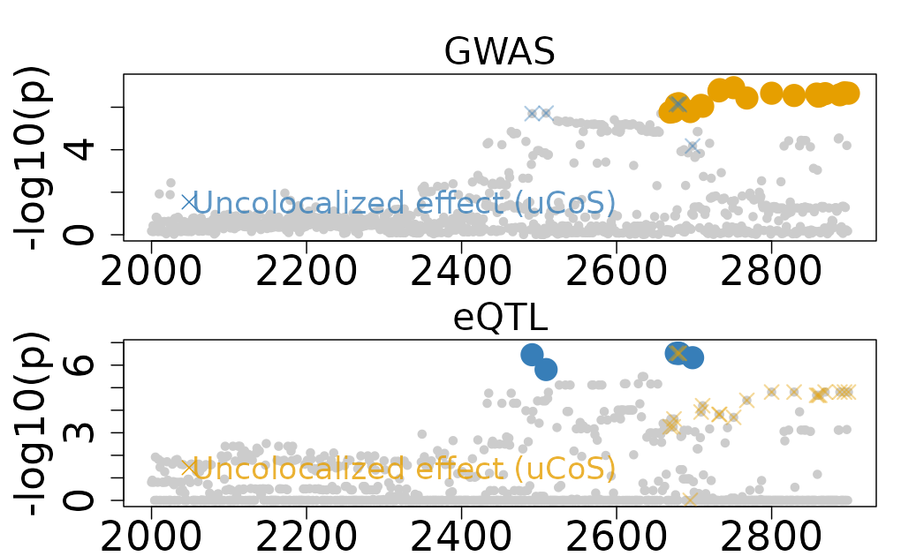
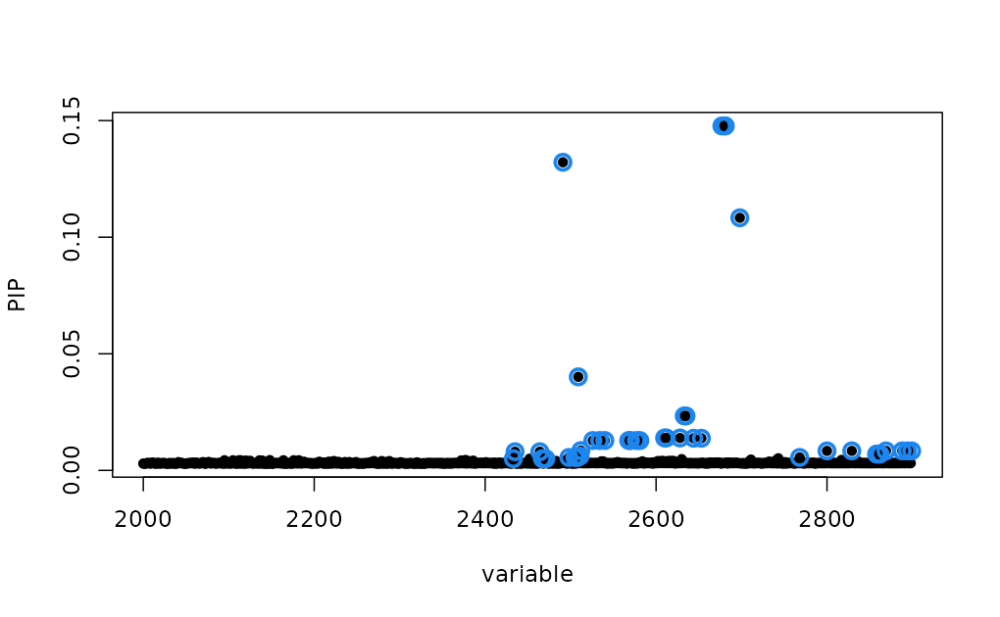
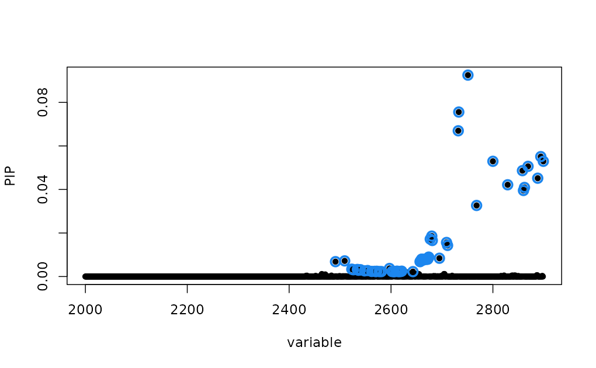

# Ambiguous Colocalization from Trait-Specific Effects

This vignette demonstrates an example of ambiguous colocalization from
trait-specific effects using the `colocboost`. Specifically, we will use
the `Ambiguous_Colocalization`, which is output from `colocboost`
analyzing GTEx release v8 and UK Biobank summary statistics (see more
details of the original data source in Acknowledgment section).

\
[`library`](https://rdrr.io/r/base/library.html)`(`[`colocboost`](https://github.com/StatFunGen/colocboost)`)`\
`# Run colocboost with diagnostic details`\
[`data`](https://rdrr.io/r/utils/data.html)`(``Ambiguous_Colocalization``)`\
[`names`](https://rdrr.io/r/base/names.html)`(``Ambiguous_Colocalization``)`\
`#> [1] "ColocBoost_Results" "SuSiE_Results"      "COLOC_V5_Results"`

## 1. The `Ambiguous_Colocalization` Dataset

The `Ambiguous_Colocalization` dataset contains results from a
colocboost analysis of a real genomic region showing ambiguous
trait-specific effects between eQTL (expression quantitative trait loci)
and GWAS (genome-wide association study) signals. Ambiguous
colocalization occurs when there appears to be shared causal variants
between traits, but the evidence is complicated by the presence of
trait-specific effects. This ambiguity typically arises when some
trait-specific boosting learners are updating very similar, yet not the
same sets of variants as these traits did not share coupled updates.

This dataset is structured as a list with two main components:

1.  `ColocBoost_Results`: Contains the output from running the
    ColocBoost algorithm.

2.  `SuSiE_Results`: Contains fine-mapping results from the SuSiE
    algorithm for both eQTL and GWAS data separately.

3.  `COLOC_V5_Results`: Contains colocalization results from COLOC,
    which is directly from two `susie` output objects.

## 2. ColocBoost results

In this example, there are two trait-specific effects for the eQTL and
GWAS signals, respectively. But two uCoS have overlapping variants,
which indicates that the two uCoS are not independent. ColocBoost
identifies two uCoS:

- `ucos1:y1`: eQTL trait-specific effect has 6 variants.
- `ucos2:y2`: GWAS trait-specific effect has 22 variants.
- There are 3 variants that are overlapping between the two uCoS.

\
`# Trait-specific effects for both eQTL and GWAS`\
`Ambiguous_Colocalization``$``ColocBoost_Results``$``ucos_details``$``ucos``$``ucos_index`\
`` #> $`ucos1:y1` ``\
`#> [1] 2491 2677 2680 2681 2698 2509`\
`#> `\
`` #> $`ucos2:y2` ``\
`#>  [1] 2751 2733 2732 2894 2800 2899 2869 2858 2888 2829 2862 2860 2768 2709 2711`\
`#> [16] 2680 2677 2681 2695 2674 2673 2669`\
\
`# Intersection of eQTL and GWAS variants`\
[`Reduce`](https://rdrr.io/r/base/funprog.html)`(``intersect``, ``Ambiguous_Colocalization``$``ColocBoost_Results``$``ucos_details``$``ucos``$``ucos_index``)`\
`#> [1] 2677 2680 2681`

After checking the correlation of variants between the two uCoS, we can
see the high correlation between the two uCoS.

- The minimum absolute correlation between the two uCoS is 0.636
  (off-diagonal `purity$min_abs_corr`).
- The median absolute correlation between the two uCoS is 0.837
  (off-diagonal `purity$median_abs_corr`).
- The maximum absolute correlation between the two uCoS is 1
  (off-diagonal `purity$max_abs_corr`), indicating overlapping variants
  exists.

\
`# With-in and between purity`\
`Ambiguous_Colocalization``$``ColocBoost_Results``$``ucos_details``$``ucos_purity`\
`#> $min_abs_cor`\
`#>           ucos1:y1  ucos2:y2`\
`#> ucos1:y1 0.6749485 0.6361986`\
`#> ucos2:y2 0.6361986 0.7048025`\
`#> `\
`#> $max_abs_cor`\
`#>           ucos1:y1  ucos2:y2`\
`#> ucos1:y1 0.8599635 1.0000000`\
`#> ucos2:y2 1.0000000 0.8815499`\
`#> `\
`#> $median_abs_cor`\
`#>           ucos1:y1  ucos2:y2`\
`#> ucos1:y1 0.8054206 0.8366998`\
`#> ucos2:y2 0.8366998 0.8859317`

Based on the results, we can see that the two uCoS are not independent,
but they are not fully overlapping.

\
`n_variables`` ``<-`` ``Ambiguous_Colocalization``$``ColocBoost_Results``$``data_info``$``n_variables`\
[`colocboost_plot`](https://statfungen.github.io/colocboost/reference/colocboost_plot.md)`(`\
`  ``Ambiguous_Colocalization``$``ColocBoost_Results``, `\
`  plot_cols ``=`` ``1``,`\
`  grange ``=`` `[`c`](https://rdrr.io/r/base/c.html)`(``2000``:``n_variables``)``,`\
`  plot_ucos ``=`` ``TRUE``,`\
`  show_cos_to_uncoloc ``=`` ``TRUE`\
`)`\
`#> Warning in get_input_plot(cb_output, plot_cos_idx = plot_cos_idx, variant_coord`\
`#> = variant_coord, : No colocalized effects in this region!`\
`#> Show all CoSs to uncolocalized outcomes.`

## 2. Fine-mapping results from SuSiE and colocalization with COLOC

In this example, we also have fine-mapping results from SuSiE for both
eQTL and GWAS data separately.

- For eQTL, SuSiE shows 40 variants in 95% credible set (CS).
- For GWAS, SuSiE shows 57 variants in 95% credible set (CS).
- There are 24 variants are overlapping between the two credible sets.

\
`susie_eQTL`` ``<-`` ``Ambiguous_Colocalization``$``SuSiE_Results``$``eQTL`\
`susie_GWAS`` ``<-`` ``Ambiguous_Colocalization``$``SuSiE_Results``$``GWAS`\
\
`# Fine-mapped eQTL`\
`susie_eQTL``$``sets``$``cs``$``L1`\
`#>  [1] 2433 2435 2464 2467 2471 2491 2498 2505 2508 2509 2511 2512 2526 2534 2540`\
`#> [16] 2568 2570 2577 2581 2610 2612 2628 2633 2635 2644 2653 2677 2680 2681 2698`\
`#> [31] 2768 2800 2829 2858 2860 2862 2869 2888 2894 2899`\
\
`# Fine-mapped GWAS variants`\
`susie_GWAS``$``sets``$``cs``$``L1`\
`#>  [1] 2491 2509 2523 2526 2534 2536 2538 2540 2548 2554 2562 2568 2570 2571 2572`\
`#> [16] 2577 2581 2597 2602 2606 2610 2612 2614 2616 2619 2621 2643 2657 2658 2660`\
`#> [31] 2661 2663 2666 2669 2670 2672 2673 2674 2677 2680 2681 2695 2709 2711 2732`\
`#> [46] 2733 2751 2768 2800 2829 2858 2860 2862 2869 2888 2894 2899`\
\
`# Intersection of fine-mapped eQTL and GWAS variants`\
[`intersect`](https://rdrr.io/r/base/sets.html)`(``susie_eQTL``$``sets``$``cs``$``L1``, ``susie_GWAS``$``sets``$``cs``$``L1``)`\
`#>  [1] 2491 2509 2526 2534 2540 2568 2570 2577 2581 2610 2612 2677 2680 2681 2768`\
`#> [16] 2800 2829 2858 2860 2862 2869 2888 2894 2899`

To visualize the fine-mapping results,

\
`susieR``::`[`susie_plot`](https://rdrr.io/pkg/susieR/man/susie_plots.html)`(``susie_eQTL``, y ``=`` ``"PIP"``, pos ``=`` ``2000``:``n_variables``)`

\
`susieR``::`[`susie_plot`](https://rdrr.io/pkg/susieR/man/susie_plots.html)`(``susie_GWAS``, y ``=`` ``"PIP"``, pos ``=`` ``2000``:``n_variables``)`

We also show the colocalization results from COLOC method. For this
ambiguous colocalization, COLOC shows

- A high posterior probability of colocalization (PP.H4) of 0.85.
- Two hits are corresponding to variants with highest PIP in SuSiE for
  eQTL and GWAS, separately.

Note that SuSiE-based COLOC has a relatively high confidence of this as
a colocalization event because each of SuSiE 95% CS as shown above cover
substantially larger region (containing more variants) compared to the
trait-specific effects identified by ColocBoost, although at a lower
purity (SuSiE purity = 0.56 and 0.64, ColocBoost uCoS purity = 0.67 and
0.70). With larger overlap between the SuSiE 95% CS across traits, the
high probability of colocalization is expected. But for this particular
data application without knowing the ground truth, it is difficult to
determine which method is more precise.

\
`# To run COLOC, please use the following command:`\
`# res <- coloc::coloc.susie(susie_eQTL, susie_GWAS)`\
`res`` ``<-`` ``Ambiguous_Colocalization``$``COLOC_V5_Results`\
`res``$``summary`\
`#>   nsnps            hit1            hit2    PP.H0.abf    PP.H1.abf   PP.H2.abf`\
`#> 1  2899 chr10:100129660 chr10:100164661 3.022783e-05 0.0009778237 0.004522211`\
`#>   PP.H3.abf PP.H4.abf idx1 idx2`\
`#> 1 0.1445868 0.8498829    1    1`

## 3. Get the ambiguous colocalization results and summary

ColocBoost provides a function to get the ambiguous colocalization
results and summary from trait-specific effects, by considering the
correlation of variants between the two uCoS.

### 3.1. Get the ambiguous colocalization results

The `get_ambiguous_colocalization` function will return the ambiguous
results in `ambigous_ucos` object, if the following conditions are met:

- The two uCoS should have at least one overlapping variant.
- The minimum absolute correlation between the two uCoS is greater than
  `min_abs_corr_between_ucos` (default is 0.5).
- The median absolute correlation between the two uCoS is greater than
  `median_abs_corr_between_ucos` (default is 0.8).

\
`colocboost_results`` ``<-`` ``Ambiguous_Colocalization``$``ColocBoost_Results`\
`res`` ``<-`` `[`get_ambiguous_colocalization`](https://statfungen.github.io/colocboost/reference/get_ambiguous_colocalization.md)`(`\
`  ``colocboost_results``, `\
`  min_abs_corr_between_ucos ``=`` ``0.5``, `\
`  median_abs_corr_between_ucos ``=`` ``0.8`\
`)`\
`#> There exists the ambiguous colocalization events from trait-specific effects. Extracting!`\
`#> There are 1 ambiguous trait-specific effects.`\
[`names`](https://rdrr.io/r/base/names.html)`(``res``)`\
`#> [1] "cos_summary"        "vcp"                "cos_details"       `\
`#> [4] "data_info"          "model_info"         "ucos_details"      `\
`#> [7] "diagnostic_details" "ambiguous_cos"`\
[`names`](https://rdrr.io/r/base/names.html)`(``res``$``ambiguous_cos``)`\
`#> [1] "ucos1:y1;ucos2:y2"`\
[`names`](https://rdrr.io/r/base/names.html)`(``res``$``ambiguous_cos``[[``1``]``]``)`\
`#> [1] "ambiguous_cos"          "ambiguous_cos_overlap"  "ambiguous_cos_union"   `\
`#> [4] "ambiguous_cos_outcomes" "ambigous_cos_weight"    "ambigous_cos_purity"   `\
`#> [7] "recalibrated_cos_vcp"   "recalibrated_cos"`

**Explanation of results** For each ambiguous colocalization, the
following information is provided:

- `ambiguous_cos`: Contains variants indices and names of the original
  trait-specific uCoS used to construct this ambiguous colocalization.
- `ambiguous_cos_overlap`: Contains the overlapping variants information
  across the uCoS used to construct this ambiguous colocalization.
- `ambiguous_cos_union`: Contains the union of variants information
  across the uCoS used to construct this ambiguous colocalization.
- `ambiguous_cos_outcomes`: Contains the outcomes indices and names for
  uCoS used to construct this ambiguous colocalization.
- `ambiguous_cos_weight`: Contains the trait-specific weights of the
  uCoS used to construct this ambiguous colocalization.
- `ambiguous_cos_puriry`: Contains the purity of across uCoS used to
  construct this ambiguous colocalization.
- `recalibrated_cos_vcp`: Contains the recalibrated integrative weight
  to analogous to variant colocalization probability (VCP) from the
  ambiguous colocalization results.
- `recalibrated_cos`: Contains the recalibrated 95% colocalization
  confidence set (CoS) from the ambiguous colocalization results.

### 3.2. Get the summary of ambiguous colocalization results

To get the summary of ambiguous colocalization results, we can use the
`get_colocboost_summary` function.

- `summary_level = 1` (default): get the summary table for only the
  colocalization results, same as `cos_summary` in ColocBoost output.
- `summary_level = 2`: get the summary table for both colocalization and
  trait-specific effects if exists.
- `summary_level = 3`: get the summary table for colocalization,
  trait-specific effects and ambiguous colocalization results if exists.

\
`# Get the full summary results from colocboost`\
`full_summary`` ``<-`` `[`get_colocboost_summary`](https://statfungen.github.io/colocboost/reference/get_colocboost_summary.md)`(``colocboost_results``, summary_level ``=`` ``3``)`\
`#> There exists the ambiguous colocalization events from trait-specific effects. Extracting!`\
`#> There are 1 ambiguous trait-specific effects.`\
[`names`](https://rdrr.io/r/base/names.html)`(``full_summary``)`\
`#> [1] "cos_summary"           "ucos_summary"          "ambiguous_cos_summary"`\
\
`# Get the summary of ambiguous colocalization results`\
`summary_ambiguous`` ``<-`` ``full_summary``$``ambiguous_cos_summary`\
[`colnames`](https://rdrr.io/r/base/colnames.html)`(``summary_ambiguous``)`\
`#>  [1] "outcomes"                   "ucos_id"                   `\
`#>  [3] "min_between_purity"         "median_between_purity"     `\
`#>  [5] "overlap_idx"                "overlap_variables"         `\
`#>  [7] "n_recalibrated_variables"   "recalibrated_index"        `\
`#>  [9] "recalibrated_variables"     "recalibrated_variables_vcp"`

- `recalibrated_*`: giving the recalibrated weights and recalibrated 95%
  colocalization confidence sets (CoS) from the trait-specific effects.

See details of function usage in the
[Functions](https://statfungen.github.io/colocboost/reference/index.html).

## 4. Take home message

In this vignette, we have demonstrated how post-processing of ColocBoost
results may be use to reconciliate ambiguous colocalization scenarios
where trait-specific effects share highly correlated and overlapping
variants.

- Through simulation studies, we have found that the minimum absolute
  correlation cutoff of 0.5 and median absolute correlation cutoff of
  0.8 produce reasonable results when merging two uCoS, which in this
  example will furnish a colocalization event. Still, we mark such
  colocalization events as `ambigous_cos`. We recommend users not to
  lower these thresholds further without strong justification.
- We suggest treating this scenario with caution and distinct such
  merged CoS from typical colocalization events as a result of coupled
  updates between traits, if researcher decides to investigate these
  ambiguous colocalization events.
- As such,
  - While we provide recalibrated weights as a suggested approach for
    interpreting ambiguous results, users can still choose between
    recalibrated weights and trait-specific weights based on their
    research context.
  - The `colocboost_plot` function will not consider it as colocalized
    but still showing them as uncolocalized events, with overlapping
    variants color labeled.

## Acknowledgment

- The eQTL data used for the analyses described in this example results
  were obtained from GTEx release v8 from [GTEx
  Portal](https://gtexportal.org/home/downloads/adult-gtex/qtl).
- The GWAS summary statistics used for the analyses described in this
  example results were obtained from UK Biobank (UKBB) from [UK
  Biobank](https://www.ukbiobank.ac.uk/) and downloaded from
  [Nealelab](https://www.nealelab.is/uk-biobank).
