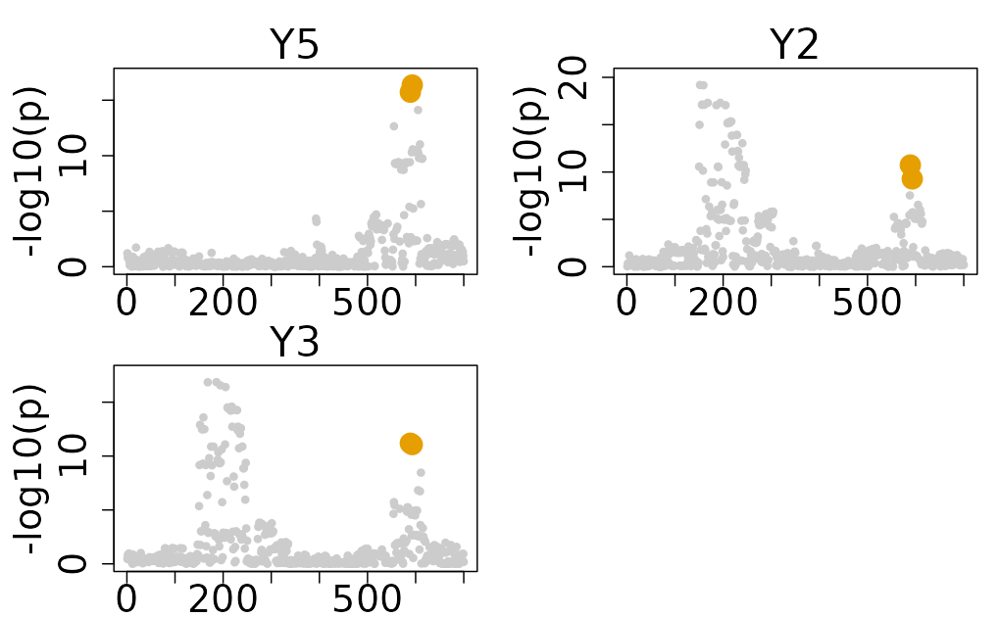
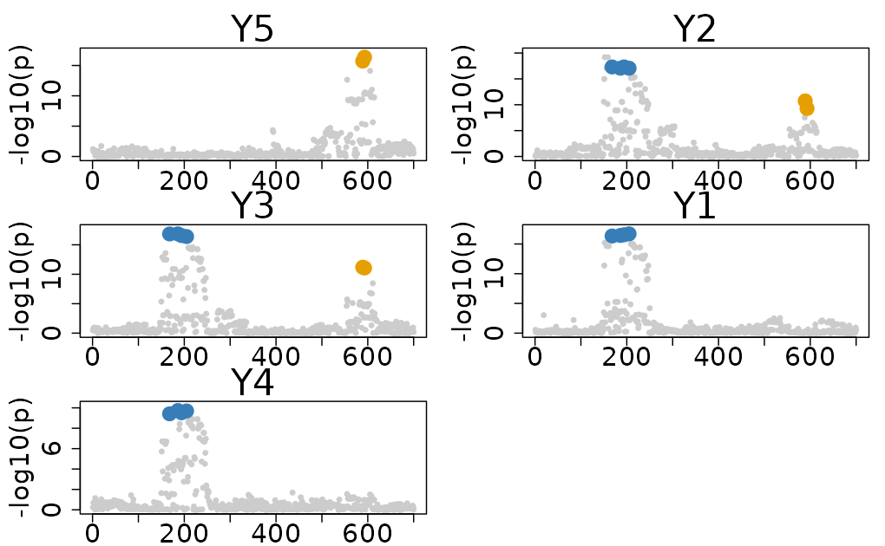

# Mixed Data-type and Disease Prioritized Colocalization

This vignette demonstrates how to perform multi-trait colocalization
analysis using a mixed-type dataset, including both individual level
data and summary statistics. ColocBoost provides a flexible framework to
integrate data both at the individual level or at the summary statistic
level, allowing the handling of scenarios where the individual data is
available for some traits (like xQTLs) and the summary data is available
for other traits (disease/trait GWAS).

\
[`library`](https://rdrr.io/r/base/library.html)`(`[`colocboost`](https://github.com/StatFunGen/colocboost)`)`

## 1. Loading individual and summary statistics data

To get started, load both `Ind_5traits` and `Sumstat_5traits` datasets
into your R session. Once loaded, create a mixed dataset as follows:

- For traits 1, 2, 3, 4: use individual level genotype and phenotype
  data.
- For trait 5: use summary statistics data.
- Note that `LD` could be calculated from the `X` data in the
  `Ind_5traits` dataset, but it is not included in the `Sumstat_5traits`
  dataset.

#### Causal variant structure

The dataset features two causal variants with indices 194 and 589.

- Causal variant 194 is associated with traits 1, 2, 3, and 4.
- Causal variant 589 is associated with traits 2, 3, and 5 (summary
  level data).

\
`# Load example data`\
[`data`](https://rdrr.io/r/utils/data.html)`(``Ind_5traits``)`\
[`data`](https://rdrr.io/r/utils/data.html)`(``Sumstat_5traits``)`` `\
\
`# Create a mixed dataset`\
`X`` ``<-`` ``Ind_5traits``$``X``[``1``:``4``]`\
`Y`` ``<-`` ``Ind_5traits``$``Y``[``1``:``4``]`\
`sumstat`` ``<-`` ``Sumstat_5traits``$``sumstat``[``5``]`\
`LD`` ``<-`` `[`get_cormat`](https://statfungen.github.io/colocboost/reference/get_cormat.md)`(``Ind_5traits``$``X``[[``1``]``]``)`

For analyze a specific one type of data, you can refer to the following
tutorials [Individual Level Data
Colocalization](https://statfungen.github.io/colocboost/articles/Individual_Level_Colocalization.html)
and [Summary Level Data
Colocalization](https://statfungen.github.io/colocboost/articles/Summary_Level_Colocalization.html).

Due to the file size limitation of CRAN release, this is a subset of
simulated data. See full dataset in [colocboost paper
repo](https://github.com/StatFunGen/colocboost-paper).

## 2. ColocBoost in disease-agnostic mode

The preferred format for colocalization analysis in ColocBoost using
mixed-type dataset:

- **Individual level data**: `X` and `Y` are organized as lists, matched
  by trait index,
  - `(X[1], Y[1])` contains individual level data for trait 1,
  - `(X[2], Y[2])` contains individual level data for trait 2,
  - And so on for each trait under analysis.
- **Summary level data**:
  - `sumstat` is organized as a list of data.frames for all traits
  - `LD` is a matrix of linkage disequilibrium (LD) information for all
    variants across all traits.

This function requires specifying genotypes `X` and phenotypes `Y` from
the individual-level dataset and summary statistics `sumstat` and LD
matrix `LD` from summary dataset:

\
`# Run colocboost`\
`res`` ``<-`` `[`colocboost`](https://statfungen.github.io/colocboost/reference/colocboost.md)`(``X ``=`` ``X``, Y ``=`` ``Y``, sumstat ``=`` ``sumstat``, LD ``=`` ``LD``)`\
`#> Validating input data.`\
`#> Starting gradient boosting algorithm.`\
`#> Gradient boosting for outcome 4 converged after 40 iterations!`\
`#> Gradient boosting for outcome 5 converged after 59 iterations!`\
`#> Gradient boosting for outcome 1 converged after 61 iterations!`\
`#> Gradient boosting for outcome 3 converged after 91 iterations!`\
`#> Gradient boosting for outcome 2 converged after 94 iterations!`\
`#> Performing inference on colocalization events.`\
`#> Extracting colocalization results with pvalue_cutoff = 0.001, cos_npc_cutoff = 0.2, and npc_outcome_cutoff = 0.2.`\
`#> Keep only CoS with cos_npc >= 0.2. For each CoS, keep the outcomes configurations that pvalue of variants for the outcome < 0.001 and npc_outcome >0.2.`\
\
`# Identified CoS`\
`res``$``cos_details``$``cos``$``cos_index`\
`` #> $`cos1:y1_y2_y3_y4` ``\
`#> [1] 186 194 168 205`\
`#> `\
`` #> $`cos2:y2_y3_y5` ``\
`#> [1] 589 593`

#### Results Interpretation

For comprehensive tutorials on result interpretation and advanced
visualization techniques, please visit our tutorials portal at
[Visualization of ColocBoost
Results](https://statfungen.github.io/colocboost/articles/Visualization_ColocBoost_Output.html)
and [Interpret ColocBoost
Output](https://statfungen.github.io/colocboost/articles/Interpret_ColocBoost_Output.html).

## 3. ColocBoost in disease-prioritized mode

When integrating with GWAS data, to mitigate the risk of biasing early
updates toward stronger xQTL signals in LD proximity-and should in fact
colocalize with-weaker signals from the disease trait of interest, we
also implement a disease-prioritized mode of ColocBoost as a soft
prioritization strategy to colocalize variants with putative causal
effects on the focal trait.

To run the disease-prioritized mode, you need to specify the
`focal_outcome_idx` argument in the
[`colocboost()`](https://statfungen.github.io/colocboost/reference/colocboost.md)
function.

- `focal_outcome_idx` indicates the index of the focal trait in all
  traits of interest.
- Note that the `focal_outcome_idx` are counted from *individual level
  data* to *summary statistics*. Therefore, in this example,
  `focal_outcome_idx = 5` is used to indicate the index of the focal
  trait from (4 individual level traits) and (1 summary statistics).

\
`# Run colocboost`\
`res`` ``<-`` `[`colocboost`](https://statfungen.github.io/colocboost/reference/colocboost.md)`(``X ``=`` ``X``, Y ``=`` ``Y``, `\
`                  sumstat ``=`` ``sumstat``, LD ``=`` ``LD``, `\
`                  focal_outcome_idx ``=`` ``5``)`\
`#> Validating input data.`\
`#> Starting gradient boosting algorithm.`\
`#> Gradient boosting for focal outcome 5 converged after 29 iterations!`\
`#> Gradient boosting for outcome 4 converged after 60 iterations!`\
`#> Gradient boosting for outcome 1 converged after 82 iterations!`\
`#> Gradient boosting for outcome 3 converged after 97 iterations!`\
`#> Gradient boosting for outcome 2 converged after 99 iterations!`\
`#> Performing inference on colocalization events.`\
`#> Extracting colocalization results with pvalue_cutoff = 0.001, cos_npc_cutoff = 0.2, and npc_outcome_cutoff = 0.2.`\
`#> Keep only CoS with cos_npc >= 0.2. For each CoS, keep the outcomes configurations that pvalue of variants for the outcome < 0.001 and npc_outcome >0.2.`\
\
`# Plotting the focal only results colocalization results`\
[`colocboost_plot`](https://statfungen.github.io/colocboost/reference/colocboost_plot.md)`(``res``, plot_focal_only ``=`` ``TRUE``)`

Unlike the other existing methods, the disease-prioritized mode of
ColocBoost only used a soft prioritization strategy. Therefore, it not
only identify the colocalization of the focal trait, but also the
colocalization across the other traits without the focal trait. To
extract all CoS and visualization of all colocalization results, you can
use the following code:

\
`# Identified CoS`\
`res``$``cos_details``$``cos``$``cos_index`\
`` #> $`cos1:y1_y2_y3_y4` ``\
`#> [1] 186 194 168 205`\
`#> `\
`` #> $`cos2:y2_y3_y5:merged` ``\
`#> [1] 589 593`\
\
`# Plotting all results`\
[`colocboost_plot`](https://statfungen.github.io/colocboost/reference/colocboost_plot.md)`(``res``)`

#### Results Interpretation

For comprehensive tutorials on result interpretation and advanced
visualization techniques, please visit our tutorials portal at
[Visualization of ColocBoost
Results](https://statfungen.github.io/colocboost/articles/Visualization_ColocBoost_Output.html)
and [Interpret ColocBoost
Output](https://statfungen.github.io/colocboost/articles/Interpret_ColocBoost_Output.html).
