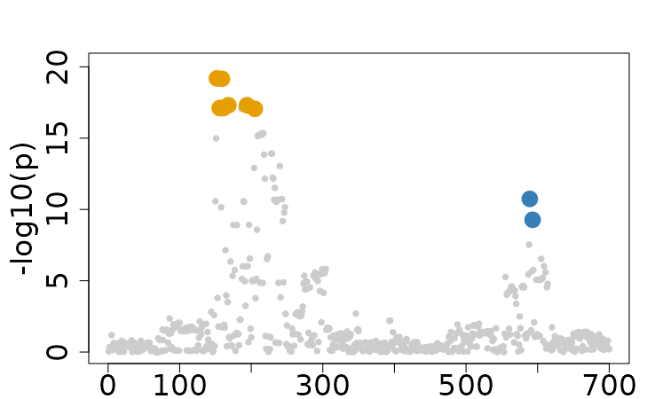
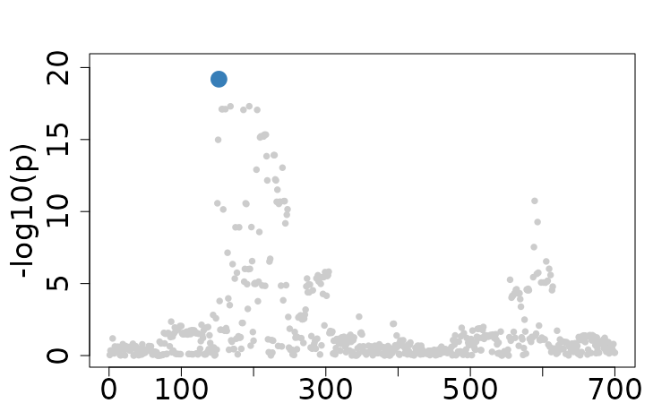

# Single-trait Fine-mapping with FineBoost

This vignette demonstrates how to perform single-trait fine-mapping
analysis using FineBoost, a specialized single-trait version of
ColocBoost, with both individual-level data and summary statistics.
Specifically focusing on the 2nd trait with 2 causal variants (194 and
589) from the `Ind_5traits` and `Sumstat_5traits` datasets included in
the package.

\
[`library`](https://rdrr.io/r/base/library.html)`(`[`colocboost`](https://github.com/StatFunGen/colocboost)`)`

## 1. Fine-mapping with individual-level data

In this section, we demonstrate how to perform fine-mapping using
individual-level genotype (`X`) and phenotype (`Y`) data. This approach
uses raw data directly to identify causal variants.

\
`# Load example data`\
[`data`](https://rdrr.io/r/utils/data.html)`(``Ind_5traits``)`\
`X`` ``<-`` ``Ind_5traits``$``X``[[``2``]``]`\
`Y`` ``<-`` ``Ind_5traits``$``Y``[[``2``]``]`\
\
`res`` ``<-`` `[`colocboost`](https://statfungen.github.io/colocboost/reference/colocboost.md)`(``X ``=`` ``X``, Y ``=`` ``Y``)`\
`#> Validating input data.`\
`#> Starting gradient boosting algorithm.`\
`#> Gradient boosting for outcome 1 converged after 44 iterations!`\
`#> Performing inference on colocalization events.`\
`#> No colocalization results in this region!`\
`#> Extracting outcome-specific (uncolocalized) results with pvalue_cutoff = 1e-05, and npc_outcome_cutoff = 0.2.`\
`#> For each uCoS, keep the outcome-specific (uncolocalized) events that pvalue of variants for the outcome < 1e-05 and npc_outcome >0.2.`\
[`colocboost_plot`](https://statfungen.github.io/colocboost/reference/colocboost_plot.md)`(``res``)`

## 2. Fine-mapping with summary statistics

This section demonstrates fine-mapping analysis using summary statistics
along with a proper LD matrix.

\
`# Load example data`\
[`data`](https://rdrr.io/r/utils/data.html)`(``Sumstat_5traits``)`` `\
`sumstat`` ``<-`` ``Sumstat_5traits``$``sumstat``[[``2``]``]`\
`LD`` ``<-`` `[`get_cormat`](https://statfungen.github.io/colocboost/reference/get_cormat.md)`(``Ind_5traits``$``X``[[``2``]``]``)`\
\
`res`` ``<-`` `[`colocboost`](https://statfungen.github.io/colocboost/reference/colocboost.md)`(``sumstat ``=`` ``sumstat``, LD ``=`` ``LD``)`\
`#> Validating input data.`\
`#> Starting gradient boosting algorithm.`\
`#> Gradient boosting for outcome 1 converged after 44 iterations!`\
`#> Performing inference on colocalization events.`\
`#> No colocalization results in this region!`\
`#> Extracting outcome-specific (uncolocalized) results with pvalue_cutoff = 1e-05, and npc_outcome_cutoff = 0.2.`\
`#> For each uCoS, keep the outcome-specific (uncolocalized) events that pvalue of variants for the outcome < 1e-05 and npc_outcome >0.2.`\
[`colocboost_plot`](https://statfungen.github.io/colocboost/reference/colocboost_plot.md)`(``res``)`

## 3. LD-free fine-mapping with one causal variant assumption

In scenarios where LD information is unavailable, FineBoost can still
perform fine-mapping under the assumption that there is a single causal
variant. This approach is less computationally intensive but assumes
that only one variant within a region is causal.

\
`# Load example data`\
`res`` ``<-`` `[`colocboost`](https://statfungen.github.io/colocboost/reference/colocboost.md)`(``sumstat ``=`` ``sumstat``)`\
`#> Validating input data.`\
`#> Warning in colocboost_validate_input_data(X = X, Y = Y, sumstat = sumstat, :`\
`#> Providing the LD or X_ref for summary statistics data is highly recommended.`\
`#> Without LD, only a single iteration will be performed under the assumption of`\
`#> one causal variable per outcome. Additionally, the purity of CoS cannot be`\
`#> evaluated!`\
`#> Starting gradient boosting algorithm.`\
`#> Running ColocBoost with assumption of one causal per outcome per region!`\
`#> Performing inference on colocalization events.`\
`#> No colocalization results in this region!`\
`#> Extracting outcome-specific (uncolocalized) results with pvalue_cutoff = 1e-05.`\
`#> Keep only uCoS with pvalue of variants for the outcome < 1e-05.`\
[`colocboost_plot`](https://statfungen.github.io/colocboost/reference/colocboost_plot.md)`(``res``)`

**Note**: Weak learners SEL in FineBoost may capture noise as putative
signals, potentially introducing false positives to our findings. To
identify and filter spurious signals, we use a fine-tuned threshold of
$`\Delta L_l`$ based on extensive simulations to balance sensitivity and
specificity. This threshold is set to 0.025 by default for ColocBoost
when detect the colocalization, but we suggested a less conservative
threshold of 0.015 for FineBoost when performing single-trait
fine-mapping analysis (`check_null_max = 0.015` as we suggested).
