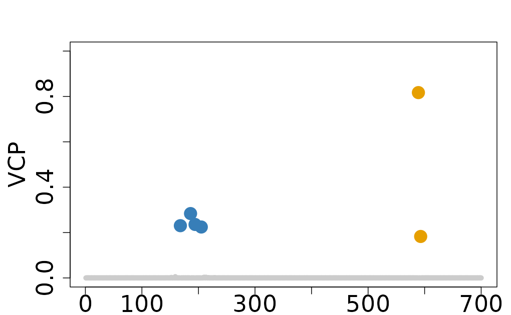
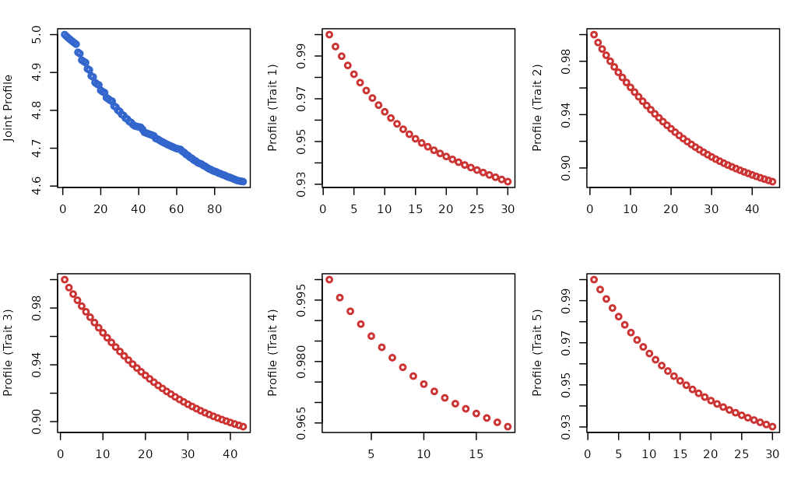
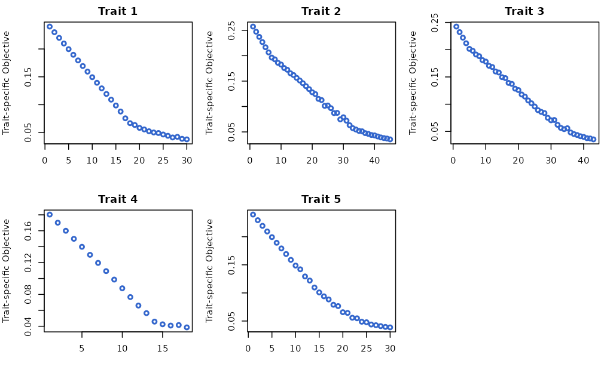
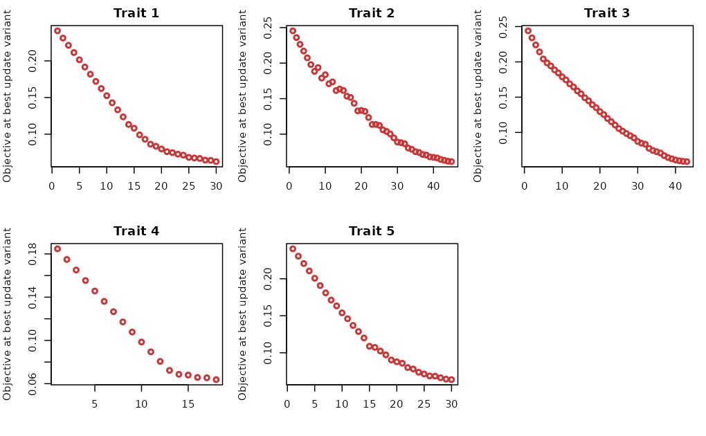

# Interpret ColocBoost Output

This vignette demonstrates how to interpret the output of ColocBoost,
specifically to get the summary of colocalization and focusing only on
strong colocalization events.

\
[`library`](https://rdrr.io/r/base/library.html)`(`[`colocboost`](https://github.com/StatFunGen/colocboost)`)`

## 1. Summarize ColocBoost results

### Causal variant structure

The dataset features two causal variants with indices 194 and 589.

- Causal variant 194 is associated with traits 1, 2, 3, and 4.
- Causal variant 589 is associated with traits 2, 3, and 5.

\
`# Loading the Dataset`\
[`data`](https://rdrr.io/r/utils/data.html)`(``Ind_5traits``)`\
`# Run colocboost `\
`res`` ``<-`` `[`colocboost`](https://statfungen.github.io/colocboost/reference/colocboost.md)`(``X ``=`` ``Ind_5traits``$``X``, Y ``=`` ``Ind_5traits``$``Y``)`\
`#> Validating input data.`\
`#> Starting gradient boosting algorithm.`\
`#> Gradient boosting for outcome 4 converged after 40 iterations!`\
`#> Gradient boosting for outcome 5 converged after 59 iterations!`\
`#> Gradient boosting for outcome 1 converged after 61 iterations!`\
`#> Gradient boosting for outcome 3 converged after 91 iterations!`\
`#> Gradient boosting for outcome 2 converged after 94 iterations!`\
`#> Performing inference on colocalization events.`\
`#> Extracting colocalization results with pvalue_cutoff = 0.001, cos_npc_cutoff = 0.2, and npc_outcome_cutoff = 0.2.`\
`#> Keep only CoS with cos_npc >= 0.2. For each CoS, keep the outcomes configurations that pvalue of variants for the outcome < 0.001 and npc_outcome >0.2.`\
`cos_summary`` ``<-`` ``res``$``cos_summary`\
[`names`](https://rdrr.io/r/base/names.html)`(``cos_summary``)`\
`#>  [1] "focal_outcome"             "colocalized_outcomes"     `\
`#>  [3] "cos_id"                    "purity"                   `\
`#>  [5] "top_variable"              "top_variable_vcp"         `\
`#>  [7] "cos_npc"                   "min_npc_outcome"          `\
`#>  [9] "n_variables"               "colocalized_index"        `\
`#> [11] "colocalized_variables"     "colocalized_variables_vcp"`

The `cos_summary` object contains the colocalization summary for all
colocalization events, with each row representing a single
colocalization event. The summary includes the following columns:

- **focal_outcome**: The focal outcome being analyzed, or `FALSE` if no
  focal outcome exists.
- **colocalized_outcomes**: Traits that are colocalized within the 95%
  colocalization confidence set (CoS).
- **cos_id**: A unique identifier for each 95% colocalization confidence
  set (CoS).
- **purity**: The minimum absolute correlation of variants within the
  95% colocalization confidence set (CoS).
- **top_variable**: The variable with the highest variant colocalization
  probability (VCP).
- **top_variable_vcp**: The variant colocalization probability for the
  top variable.
- **cos_npc**: The normalized probability of colocalization for the 95%
  confidence set, providing empirical evidence in favor of
  colocalization over a trait-specific configuration.
- **min_npc_outcome**: The minimum normalized probability among
  colocalized traits.
- **n_variables**: The number of variables in the 95% colocalization
  confidence set (CoS).
- **colocalized_index**: The indices of colocalized variables.
- **colocalized_variables**: A list of colocalized variables.
- **colocalized_variables_vcp**: The variant colocalization
  probabilities for all colocalized variables.

To obtain the summary of colocalization with a specific focus on traits
of interest, you can use the `get_cos_summary`, see the detailed usage
of this function in
[link](https://statfungen.github.io/colocboost/reference/get_cos_summary.html).
This function allows you to filter the colocalization summary based on a
particular outcome of interest, making it easier to interpret the
results for specific traits. For example, if you are interested in the
colocalization events involving the traits `Y1` and `Y2`, you can use
the following code:

\
`# Get summary table of colocalization`\
`cos_interest_outcome`` ``<-`` `[`get_cos_summary`](https://statfungen.github.io/colocboost/reference/get_cos_summary.md)`(``res``, interest_outcome ``=`` `[`c`](https://rdrr.io/r/base/c.html)`(``"Y1"``, ``"Y2"``)``)`

## 2. Filter colocalization events by relative strength of evidence

In `cos_summary`, for each 95% CoS, the `cos_npc` column provides a
normalized probability of colocalization and `min_npc_outcome` column
provides the minimum normalized probability among colocalized traits.
Those two metrics are measured as an empirical evidence of
colocalization both in CoS-level and in trait-level. To obtain the best
minimal colocalization configuration can be defined by using both
`cos_npc` and `npc_outcome`. See the detailed usage of this function in
[link](https://statfungen.github.io/colocboost/reference/get_robust_colocalization.html).

\
`filter_res`` ``<-`` `[`get_robust_colocalization`](https://statfungen.github.io/colocboost/reference/get_robust_colocalization.md)`(``res``, cos_npc_cutoff ``=`` ``0.5``, npc_outcome_cutoff ``=`` ``0.2``)`\
`#> Extracting colocalization results with cos_npc_cutoff = 0.5 and npc_outcome_cutoff = 0.2.`\
`#> Keep only CoS with cos_npc >= 0.5. For each CoS, keep the outcomes configurations that the npc_outcome >= 0.2.`

- The output from `get_robust_colocalization` is the same as output from
  `colocboost`, which can be directly used in any post inference and
  visualization.
- `npc=0.5` or `npc_outcome = 0.2` maintains robust colocalization
  signals for cases when many traits are evaluated. Higher thresholds
  can be specified if users want to focus only on strong colocalization
  events.

## 3. More details on ColocBoost output

The entire colocalization output from `colocboost` is stored in the
`colocboost` object, which contains several components:

- **`cos_summary`**: A summary table for colocalization events (see
  details in above Section 1).
- **`vcp`**: The variable colocalized probability for each variable.
- **`cos_details`**: A object with all information for colocalization
  results.
- **`data_info`**: A object with the detailed information from input
  data.
- **`model_info`**: A object with the detailed information for
  colocboost model.

In this section, we will provide a detailed explanation of the
components for deepening into ColocBoost result using a mixed dataset.

\
`# Load example data`\
[`data`](https://rdrr.io/r/utils/data.html)`(``Ind_5traits``)`\
[`data`](https://rdrr.io/r/utils/data.html)`(``Sumstat_5traits``)`` `\
`# Create a mixed dataset`\
`X`` ``<-`` ``Ind_5traits``$``X``[``1``:``4``]`\
`Y`` ``<-`` ``Ind_5traits``$``Y``[``1``:``4``]`\
`sumstat`` ``<-`` ``Sumstat_5traits``$``sumstat``[``5``]`\
`LD`` ``<-`` `[`get_cormat`](https://statfungen.github.io/colocboost/reference/get_cormat.md)`(``Ind_5traits``$``X``[[``1``]``]``)`\
`# Run colocboost`\
`res`` ``<-`` `[`colocboost`](https://statfungen.github.io/colocboost/reference/colocboost.md)`(``X ``=`` ``X``, Y ``=`` ``Y``, sumstat ``=`` ``sumstat``, LD ``=`` ``LD``)`\
`#> Validating input data.`\
`#> Starting gradient boosting algorithm.`\
`#> Gradient boosting for outcome 4 converged after 40 iterations!`\
`#> Gradient boosting for outcome 5 converged after 59 iterations!`\
`#> Gradient boosting for outcome 1 converged after 61 iterations!`\
`#> Gradient boosting for outcome 3 converged after 91 iterations!`\
`#> Gradient boosting for outcome 2 converged after 94 iterations!`\
`#> Performing inference on colocalization events.`\
`#> Extracting colocalization results with pvalue_cutoff = 0.001, cos_npc_cutoff = 0.2, and npc_outcome_cutoff = 0.2.`\
`#> Keep only CoS with cos_npc >= 0.2. For each CoS, keep the outcomes configurations that pvalue of variants for the outcome < 0.001 and npc_outcome >0.2.`

### 3.1. Variant colocalization probability (**`vcp`**)

- **`vcp`** is the probability of a variant being colocalized with at
  least one traits, serving as analogs of posterior inclusion
  probabilities (PIPs) in single-trait fine-mapping. To plot the VCP for
  the variants within at least one CoS, you can use the
  `colocboost_plot` function with the `y` argument set to `"vcp"`.

\
[`colocboost_plot`](https://statfungen.github.io/colocboost/reference/colocboost_plot.md)`(``res``, y ``=`` ``"vcp"``)`

Please visit our documentation portal at [Visualization of ColocBoost
Results](https://statfungen.github.io/colocboost/articles/Visualization_ColocBoost_Output.html)
for more details on the `colocboost_plot` function

### 3.2. Analyzed data information (**`data_info`**)

- **`n_variables`**: number of variants being included.
- **`variables`**: vector of variant names across all traits being
  included in colocalization analysis.
- **`coef`**: regression coefficients estimated from the colocboost
  model for each trait.
- **`z`**: z-scores from marginal associations for each trait.
- **`n_outcomes`**: the number of traits being included in
  colocalization analysis.
- **`outcome_info`** contains information of analyzed data, including
  sample size and data type.

\
`res``$``data_info``$``outcome_info`\
`#>    outcome_names sample_size is_sumstats is_focal`\
`#> y1            Y1        1153       FALSE    FALSE`\
`#> y2            Y2        1153       FALSE    FALSE`\
`#> y3            Y3        1153       FALSE    FALSE`\
`#> y4            Y4        1153       FALSE    FALSE`\
`#> y5            Y5        1153        TRUE    FALSE`

### 3.3. Colocalization details (**`cos_details`**)

**`cos_details`** provides a detailed information for colocalization
events identified by `colocboost`. This section will provide a detailed
explanation of the components in `cos_details`.

\
[`names`](https://rdrr.io/r/base/names.html)`(``res``$``cos_details``)`\
`#> [1] "cos"                 "cos_outcomes"        "cos_vcp"            `\
`#> [4] "cos_outcomes_npc"    "cos_npc"             "cos_min_npc_outcome"`\
`#> [7] "cos_purity"          "cos_top_variables"   "cos_weights"`

#### 3.3.1. Colocalized variants for each CoS (**`cos`**)

- **`cos`**: A list with a detailed information of colocalized variants
  for each CoS.
  - **`cos_index`**: Indices of colocalized variables with unique
    identifier for each CoS.
  - **`cos_variables`**: Names of colocalized variables with unique
    identifier for each CoS.
- Note that variants are ordered by their VCP in descending order.

\
`res``$``cos_details``$``cos`\
`#> $cos_index`\
`` #> $cos_index$`cos1:y1_y2_y3_y4` ``\
`#> [1] 186 194 168 205`\
`#> `\
`` #> $cos_index$`cos2:y2_y3_y5` ``\
`#> [1] 589 593`\
`#> `\
`#> `\
`#> $cos_variables`\
`` #> $cos_variables$`cos1:y1_y2_y3_y4` ``\
`#> [1] "rs_186" "rs_194" "rs_168" "rs_205"`\
`#> `\
`` #> $cos_variables$`cos2:y2_y3_y5` ``\
`#> [1] "rs_589" "rs_593"`

#### 3.3.2. Colocalized traits for each 95% CoS (**`cos_outcomes`**)

- **`cos_outcomes`**: A list with a detailed information of colocalized
  traits for each CoS.
  - **`outcome_index`**: Indices of colocalized traits with unique
    identifier for each CoS.
  - **`outcome_name`**: Names of colocalized traits with unique
    identifier for each CoS.

\
`res``$``cos_details``$``cos_outcomes`\
`#> $outcome_index`\
`` #> $outcome_index$`cos1:y1_y2_y3_y4` ``\
`#> [1] 1 2 3 4`\
`#> `\
`` #> $outcome_index$`cos2:y2_y3_y5` ``\
`#> [1] 2 3 5`\
`#> `\
`#> `\
`#> $outcome_name`\
`` #> $outcome_name$`cos1:y1_y2_y3_y4` ``\
`#> [1] "Y1" "Y2" "Y3" "Y4"`\
`#> `\
`` #> $outcome_name$`cos2:y2_y3_y5` ``\
`#> [1] "Y2" "Y3" "Y5"`

- **`cos_npc`**: normalized probability of colocalization for CoS,
  providing empirical evidence in favor of colocalization over a
  trait-specific configuration.
- **`cos_outcomes_npc`**: normalized probability for each colocalized
  trait in order with evidence strength.
- These two metrics could be used to filter the colocalization events by
  relative strength of evidence, see details in Section 2.

\
`res``$``cos_details``$``cos_npc`\
`#> cos1:y1_y2_y3_y4    cos2:y2_y3_y5 `\
`#>        0.9989418        0.9974159`\
`res``$``cos_details``$``cos_outcomes_npc`\
`` #> $`cos1:y1_y2_y3_y4` ``\
`#>    outcomes_index relative_logLR npc_outcome`\
`#> Y3              3      2.2563485   0.9890312`\
`#> Y1              1      1.8287003   0.9742005`\
`#> Y4              4      0.9499365   0.8504124`\
`#> Y2              2      0.6414479   0.7227667`\
`#> `\
`` #> $`cos2:y2_y3_y5` ``\
`#>    outcomes_index relative_logLR npc_outcome`\
`#> Y5              5       1.994252   0.9814726`\
`#> Y3              3       1.494458   0.9496581`\
`#> Y2              2       1.475390   0.9477011`

- **`cos_purity`**: includes three lists, for each list, it contains
  $`S \times S`$ matrix, where $`S`$ is the number of CoS.
  - `min_abs_cor`: the minimum absolute correlation of variants within
    (diagonal) CoS or in-between (off-diagonal) different CoS.
  - `median_abs_cor`: the median absolute correlation of variants within
    (diagonal) CoS or in-between (off-diagonal) different CoS.
  - `max_abs_cor`: the maximum absolute correlation of variants within
    (diagonal) CoS or in-between (off-diagonal) different CoS.

\
`res``$``cos_details``$``cos_purity`\
`#> $min_abs_cor`\
`#>                  cos1:y1_y2_y3_y4 cos2:y2_y3_y5`\
`#> cos1:y1_y2_y3_y4     9.941612e-01  4.086608e-05`\
`#> cos2:y2_y3_y5        4.086608e-05  9.761542e-01`\
`#> `\
`#> $max_abs_cor`\
`#>                  cos1:y1_y2_y3_y4 cos2:y2_y3_y5`\
`#> cos1:y1_y2_y3_y4      0.996765520   0.002824775`\
`#> cos2:y2_y3_y5         0.002824775   0.976154165`\
`#> `\
`#> $median_abs_cor`\
`#>                  cos1:y1_y2_y3_y4 cos2:y2_y3_y5`\
`#> cos1:y1_y2_y3_y4     0.9970944352  0.0004030735`\
`#> cos2:y2_y3_y5        0.0004030735  0.9761541652`

- **`cos_top_variables`**: indices and names of the top variant for each
  CoS, which is the variant with the highest VCP.
- Note that there may exist multiple variants in perfect LD with the
  same highest VCP.

\
`res``$``cos_details``$``cos_top_variables`\
`#>                  top_index top_variables`\
`#> cos1:y1_y2_y3_y4       186        rs_186`\
`#> cos2:y2_y3_y5          589        rs_589`

- **`cos_weights`**: the integrative weights for each colocalized trait
  in the CoS. This is used to recalibrate CoS when some traits are
  filtered out..
- **`cos_vcp`**: the single-effect VCP for each CoS.

### 3.4. Model information (**`model_info`**)

- **`model_coveraged`**: if the model is converged.
- **`outcome_model_coveraged`**: if the trait-specific model is
  converged.
- **`n_updates`**: number of boosting rounds
- **`outcome_n_updates`**: number of boosting rounds for each trait.
- **`jk_update`**: indices of the variants being updated in the model at
  each boosting round.

\
`# Pick arbitrary SEC updates, see entire update in advance`\
`res``$``model_info``$``jk_star``[`[`c`](https://rdrr.io/r/base/c.html)`(``5``:``10``,``36``:``38``)``, ``]`\
`#>             Y1  Y2  Y3  Y4  Y5`\
`#> jk_star_5   NA  NA  NA  NA 593`\
`#> jk_star_6   NA  NA  NA  NA 593`\
`#> jk_star_7  186 186 186 186  NA`\
`#> jk_star_8   NA  NA  NA  NA 593`\
`#> jk_star_9  186 186 186 186  NA`\
`#> jk_star_10  NA  NA  NA  NA 593`\
`#> jk_star_36 186  NA 186 186  NA`\
`#> jk_star_37  NA  NA 589 340  NA`\
`#> jk_star_38  NA  NA  NA 436  NA`

- **`profile_loglik`**: joint profile log-likelihood changes over
  boosting rounds.
- **`outcome_profile_loglik`**: trait-specific profile log-likelihood
  changes over boosting rounds.

\
`# Plotting joint profile log-likelihood (blue) and trait-specific profile log-likelihood (red).`\
[`par`](https://rdrr.io/r/graphics/par.html)`(``mfrow``=`[`c`](https://rdrr.io/r/base/c.html)`(``2``,``3``)``,mar``=`[`c`](https://rdrr.io/r/base/c.html)`(``4``,``4``,``2``,``1``)``)`\
[`plot`](https://rdrr.io/r/graphics/plot.default.html)`(``res``$``model_info``$``profile_loglik``, type``=``"p"``, col``=``"#3366CC"``, lwd``=``2``, xlab``=``""``, ylab``=``"Joint Profile"``)`\
`for``(``i`` ``in`` ``1``:``5``)``{`\
[`plot`](https://rdrr.io/r/graphics/plot.default.html)`(``res``$``model_info``$``outcome_profile_loglik``[[``i``]``]``, type``=``"p"``, col``=``"#CC3333"``, lwd``=``2``, xlab``=``""``, ylab``=`[`paste0`](https://rdrr.io/r/base/paste.html)`(``"Profile (Trait "``, ``i``, ``")"``)``)`\
`}`

- **`outcome_proximity_obj`**: trait-specific proximity smoothed
  objective for each trait.
- **`outcome_coupled_best_update_obj`**: objective at the (coupled) best
  update variant for each outcome.

\
`# Save to restore default options`\
`oldpar`` ``<-`` `[`par`](https://rdrr.io/r/graphics/par.html)`(``no.readonly ``=`` ``TRUE``)`\
`# Plotting trait-specific proximity objective`\
[`par`](https://rdrr.io/r/graphics/par.html)`(``mfrow``=`[`c`](https://rdrr.io/r/base/c.html)`(``2``,``3``)``, mar``=`[`c`](https://rdrr.io/r/base/c.html)`(``4``,``4``,``2``,``1``)``)`\
`for``(``i`` ``in`` ``1``:``5``)``{`\
[`plot`](https://rdrr.io/r/graphics/plot.default.html)`(``res``$``model_info``$``outcome_proximity_obj``[[``i``]``]``, type``=``"p"``, col``=``"#3366CC"``, lwd``=``2``, xlab``=``""``, ylab``=``"Trait-specific Objective"``, main ``=`` `[`paste0`](https://rdrr.io/r/base/paste.html)`(``"Trait "``, ``i``)``)`\
`}`\
[`par`](https://rdrr.io/r/graphics/par.html)`(``oldpar``)`

\
`# Save to restore default options`\
`oldpar`` ``<-`` `[`par`](https://rdrr.io/r/graphics/par.html)`(``no.readonly ``=`` ``TRUE``)`\
`# Plotting trait-specific objective at the best update variant`\
[`par`](https://rdrr.io/r/graphics/par.html)`(``mfrow``=`[`c`](https://rdrr.io/r/base/c.html)`(``2``,``3``)``, mar``=`[`c`](https://rdrr.io/r/base/c.html)`(``4``,``4``,``2``,``1``)``)`\
`for``(``i`` ``in`` ``1``:``5``)``{`` `\
`  `[`plot`](https://rdrr.io/r/graphics/plot.default.html)`(``res``$``model_info``$``outcome_coupled_best_update_obj``[[``i``]``]``, type``=``"p"``, col``=``"#CC3333"``, lwd``=``2``, xlab``=``""``, ylab``=`[`paste0`](https://rdrr.io/r/base/paste.html)`(``"Objective at best update variant"``)``, main ``=`` `[`paste0`](https://rdrr.io/r/base/paste.html)`(``"Trait "``, ``i``)``)`` `\
`}`\
[`par`](https://rdrr.io/r/graphics/par.html)`(``oldpar``)`

### 3.5. Trait-specific effects information (**`ucos_details`**)

There is `ucos_details` in ColocBoost output when setting
`output_level = 2`, including the trait-specific (uncolocalized)
information from the single-effect learner (SEL).

\
`# Create a mixed dataset`\
[`data`](https://rdrr.io/r/utils/data.html)`(``Ind_5traits``)`\
[`data`](https://rdrr.io/r/utils/data.html)`(``Heterogeneous_Effect``)`\
`X`` ``<-`` ``Ind_5traits``$``X``[``1``:``3``]`\
`Y`` ``<-`` ``Ind_5traits``$``Y``[``1``:``3``]`\
`X1`` ``<-`` ``Heterogeneous_Effect``$``X`\
`Y1`` ``<-`` ``Heterogeneous_Effect``$``Y``[``,``1``,drop``=``F``]`\
`res`` ``<-`` `[`colocboost`](https://statfungen.github.io/colocboost/reference/colocboost.md)`(``X ``=`` `[`c`](https://rdrr.io/r/base/c.html)`(``X``, `[`list`](https://rdrr.io/r/base/list.html)`(``X1``)``)``, Y ``=`` `[`c`](https://rdrr.io/r/base/c.html)`(``Y``, `[`list`](https://rdrr.io/r/base/list.html)`(``Y1``)``)``, output_level ``=`` ``2``)`\
`#> Validating input data.`\
`#> Starting gradient boosting algorithm.`\
`#> Gradient boosting for outcome 1 converged after 86 iterations!`\
`#> Gradient boosting for outcome 3 converged after 99 iterations!`\
`#> Gradient boosting for outcome 4 converged after 103 iterations!`\
`#> Gradient boosting for outcome 2 converged after 113 iterations!`\
`#> Performing inference on colocalization events.`\
`#> Extracting colocalization results with pvalue_cutoff = 0.001, cos_npc_cutoff = 0.2, and npc_outcome_cutoff = 0.2.`\
`#> Keep only CoS with cos_npc >= 0.2. For each CoS, keep the outcomes configurations that pvalue of variants for the outcome < 0.001 and npc_outcome >0.2.`\
`#> Extracting outcome-specific (uncolocalized) results with pvalue_cutoff = 1e-05, and npc_outcome_cutoff = 0.2.`\
`#> For each uCoS, keep the outcome-specific (uncolocalized) events that pvalue of variants for the outcome < 1e-05 and npc_outcome >0.2.`\
[`names`](https://rdrr.io/r/base/names.html)`(``res``$``ucos_details``)`\
`#> [1] "ucos"               "ucos_outcomes"      "ucos_weight"       `\
`#> [4] "ucos_top_variables" "ucos_purity"        "cos_ucos_purity"   `\
`#> [7] "ucos_outcomes_npc"`

#### 3.5.1. Trait-specific (uncolocalized) confidence sets (**`ucos`**)

- **`ucos`**: A list containing a detailed information about
  trait-specific (uncolocalized) variants for each uCoS.
  - **`ucos_index`**: Indices of trait-specific (uncolocalized)
    variants.
  - **`ucos_variables`**: Names of trait-specific (uncolocalized)
    variants.

\
`res``$``ucos_details``$``ucos`\
`#> $ucos_index`\
`` #> $ucos_index$`ucos1:y4` ``\
`#> [1] 322`\
`#> `\
`` #> $ucos_index$`ucos2:y4` ``\
`#>  [1]  982  993  983  981  970  988  942  972 1000  987 1005  971  973  990  991`\
`#> [16]  958  976  977  975  906  938`\
`#> `\
`#> `\
`#> $ucos_variables`\
`` #> $ucos_variables$`ucos1:y4` ``\
`#> [1] "rs_322"`\
`#> `\
`` #> $ucos_variables$`ucos2:y4` ``\
`#>  [1] "rs_982"  "rs_993"  "rs_983"  "rs_981"  "rs_970"  "rs_988"  "rs_942" `\
`#>  [8] "rs_972"  "rs_1000" "rs_987"  "rs_1005" "rs_971"  "rs_973"  "rs_990" `\
`#> [15] "rs_991"  "rs_958"  "rs_976"  "rs_977"  "rs_975"  "rs_906"  "rs_938"`

#### 3.5.2. Trait-specific (uncolocalized) outcomes (**`ucos_outcomes`**)

- **`ucos_outcomes`**: A list with a detailed information about
  trait-specific (uncolocalized) outcomes for each uCoS.
  - **`outcome_index`**: Indices of trait-specific (uncolocalized)
    outcomes.
  - **`outcome_name`**: Names of trait-specific (uncolocalized)
    outcomes.

\
`res``$``ucos_details``$``ucos_outcomes`\
`#> $outcome_index`\
`` #> $outcome_index$`ucos1:y4` ``\
`#> [1] 4`\
`#> `\
`` #> $outcome_index$`ucos2:y4` ``\
`#> [1] 4`\
`#> `\
`#> `\
`#> $outcome_name`\
`` #> $outcome_name$`ucos1:y4` ``\
`#> [1] "Y4"`\
`#> `\
`` #> $outcome_name$`ucos2:y4` ``\
`#> [1] "Y4"`

#### 3.5.3. Purity across CoS and uCoS (**`cos_ucos_purity`**)

- **`cos_ucos_purity`**: Includes three lists, each containing an
  $`S \times uS`$ matrix, where $`S`$ is the number of CoS and $`uS`$ is
  the number of uCoS:
  - `min_abs_cor`: Minimum absolute correlation of variables across each
    pair of CoS and uCoS.
  - `median_abs_cor`: Median absolute correlation of variables across
    each pair of CoS and uCoS.
  - `max_abs_cor`: Maximum absolute correlation of variables across each
    pair of CoS and uCoS.

\
`res``$``ucos_details``$``cos_ucos_purity`\
`#> $min_abs_cor`\
`#>                    ucos1:y4   ucos2:y4`\
`#> cos1:y1_y2_y3     0.1132965 0.05866258`\
`#> cos2:y2_y3:merged 0.1675803 0.03404661`\
`#> `\
`#> $max_abs_cor`\
`#>                    ucos1:y4  ucos2:y4`\
`#> cos1:y1_y2_y3     0.4111256 0.4507412`\
`#> cos2:y2_y3:merged 0.5222858 0.5905318`\
`#> `\
`#> $median_abs_cor`\
`#>                    ucos1:y4  ucos2:y4`\
`#> cos1:y1_y2_y3     0.3633263 0.2969155`\
`#> cos2:y2_y3:merged 0.3449331 0.3134146`

#### 3.5.4. Other components

- **`ucos_weight`**: Integrative weights for each trait-specific
  (uncolocalized) trait, used to recalibrate uCoS when traits are
  filtered out.
- **`ucos_top_variables`**: Indices and names of the top variable for
  each uCoS, which is the variable with the highest VCP.
- **`ucos_purity`**: Includes three lists, each containing an
  $`uS \times uS`$ matrix, where $`uS`$ is the number of uCoS:
  - `min_abs_cor`: Minimum absolute correlation of variables within
    (diagonal) uCoS or between (off-diagonal) different uCoS.
  - `median_abs_cor`: Median absolute correlation of variables within or
    between uCoS.
  - `max_abs_cor`: Maximum absolute correlation of variables within or
    between uCoS.

By analyzing these components, you can gain a deeper understanding of
trait-specific (uncolocalized) effects that are not colocalized,
providing additional insights into the data.

### 3.6. Diagnostic details (**`diagnostic_details`**)

There is `diagnostic_details` in ColocBoost output when setting
`output_level = 3`:

\
`# Loading the dataset`\
[`data`](https://rdrr.io/r/utils/data.html)`(``Ind_5traits``)`\
`X`` ``<-`` ``Ind_5traits``$``X`\
`Y`` ``<-`` ``Ind_5traits``$``Y`\
`res`` ``<-`` `[`colocboost`](https://statfungen.github.io/colocboost/reference/colocboost.md)`(``X ``=`` ``X``, Y ``=`` ``Y``, output_level ``=`` ``3``)`\
`#> Validating input data.`\
`#> Starting gradient boosting algorithm.`\
`#> Gradient boosting for outcome 4 converged after 40 iterations!`\
`#> Gradient boosting for outcome 5 converged after 59 iterations!`\
`#> Gradient boosting for outcome 1 converged after 61 iterations!`\
`#> Gradient boosting for outcome 3 converged after 91 iterations!`\
`#> Gradient boosting for outcome 2 converged after 94 iterations!`\
`#> Performing inference on colocalization events.`\
`#> Extracting colocalization results with pvalue_cutoff = 0.001, cos_npc_cutoff = 0.2, and npc_outcome_cutoff = 0.2.`\
`#> Keep only CoS with cos_npc >= 0.2. For each CoS, keep the outcomes configurations that pvalue of variants for the outcome < 0.001 and npc_outcome >0.2.`\
`#> No uncolocalized results in this region!`

- **`cb_model`**: trait-specific proximity gradient boosting model,
  including proximity weight at each iteration, residual after gradient
  boosting, etc.
- **`weights_paths`**: individual trait-specific weights for each
  iteration.

\
[`names`](https://rdrr.io/r/base/names.html)`(``res``$``diagnostic_details``$``cb_model``)`\
`#> [1] "ind_outcome_1" "ind_outcome_2" "ind_outcome_3" "ind_outcome_4"`\
`#> [5] "ind_outcome_5"`\
[`names`](https://rdrr.io/r/base/names.html)`(``res``$``diagnostic_details``$``cb_model``$``ind_outcome_1``)`\
`#>  [1] "res"                         "beta"                       `\
`#>  [3] "weights_path"                "profile_loglike_each"       `\
`#>  [5] "obj_path"                    "obj_single"                 `\
`#>  [7] "change_loglike"              "correlation"                `\
`#>  [9] "z"                           "learning_rate_init"         `\
`#> [11] "stop_thresh"                 "ld_jk"                      `\
`#> [13] "jk"                          "scaling_factor"             `\
`#> [15] "beta_scaling"                "XtX_beta_cache"             `\
`#> [17] "z_univariate"                "beta_hat_univariate"        `\
`#> [19] "multi_correction"            "multi_correction_univariate"`\
`#> [21] "stop_null"                   "check_null_max"             `\
`#> [23] "check_null_max_ucos"         "beta_hat"`

- **`cb_model_para`**: parameters used in fitting ColocBoost model.

\
[`names`](https://rdrr.io/r/base/names.html)`(``res``$``diagnostic_details``$``cb_model_para``)`\
`#>  [1] "L"                     "P"                     "N"                    `\
`#>  [4] "tau"                   "func_simplex"          "lambda"               `\
`#>  [7] "lambda_focal_outcome"  "learning_rate_decay"   "profile_loglike"      `\
`#> [10] "dynamic_learning_rate" "prioritize_jkstar"     "jk_equiv_corr"        `\
`#> [13] "jk_equiv_loglik"       "func_compare"          "coloc_thresh"         `\
`#> [16] "update_status"         "jk"                    "LD_free"              `\
`#> [19] "real_update_jk"        "outcome_names"         "variables"            `\
`#> [22] "focal_outcome_idx"     "coveraged"             "num_updates"          `\
`#> [25] "coveraged_outcome"     "num_updates_outcome"   "func_multi_test"      `\
`#> [28] "multi_test_thresh"     "multi_test_max"        "model_used"           `\
`#> [31] "ld_mismatch"           "M"                     "no_coverage_stop"     `\
`#> [34] "use_entropy"           "weight_fudge_factor"   "coverage"             `\
`#> [37] "min_abs_corr"          "n_purity"`
