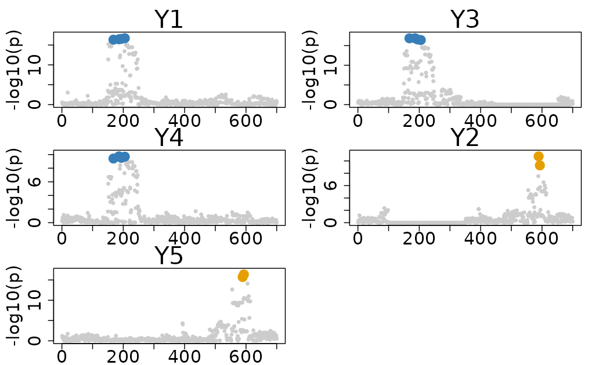
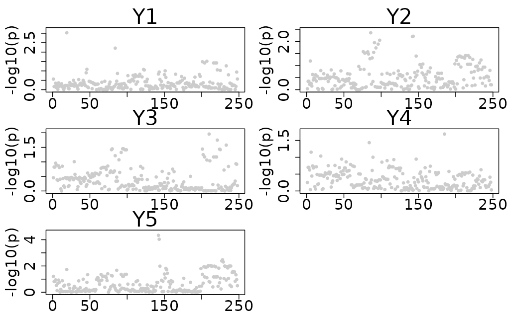
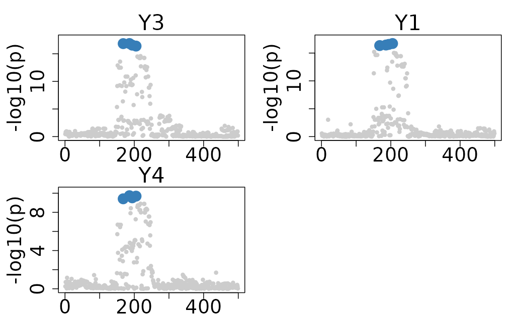

# Handling Partial Overlapping Variants across Traits in ColocBoost

This vignette demonstrates how ColocBoost handles partial overlapping
variants across traits in ColocBoost.

\
[`library`](https://rdrr.io/r/base/library.html)`(`[`colocboost`](https://github.com/StatFunGen/colocboost)`)`

Illustration of partial overlapping variants across traits

### Causal variant structure

We create an example data from `Ind_5traits` with two causal variants,
644 and 2289, but each of them is only partially overlapping across
traits.

- Causal variant 194 is associated with traits 1, 3, and 4, but is
  missing in trait 2.
- Causal variant 589 is associated with traits 2 and 3, but is missing
  in trait 5.

This structure creates a realistic scenario in which multiple traits
from different datasets are not fully overlapping, and the causal
variants are not shared across all traits.

\
`# Load example data`\
[`data`](https://rdrr.io/r/utils/data.html)`(``Ind_5traits``)`\
`X`` ``<-`` ``Ind_5traits``$``X`\
`Y`` ``<-`` ``Ind_5traits``$``Y`\
\
`# Create causal variants with potentially LD proxies`\
`causal_1`` ``<-`` `[`c`](https://rdrr.io/r/base/c.html)`(``100``:``350``)`\
`causal_2`` ``<-`` `[`c`](https://rdrr.io/r/base/c.html)`(``450``:``650``)`\
\
`# Create missing data`\
`X``[[``2``]``]`` ``<-`` ``X``[[``2``]``]``[``, ``-``causal_1``, drop ``=`` ``FALSE``]`\
`X``[[``3``]``]`` ``<-`` ``X``[[``3``]``]``[``, ``-``causal_2``, drop ``=`` ``FALSE``]`\
\
`# Show format`\
`X``[[``2``]``]``[``1``:``2``, ``1``:``6``]`\
`#>               rs_1     rs_2     rs_3     rs_4       rs_5       rs_6`\
`#> sample_1 0.6197206 1.064107 1.064107 1.103145 -0.3373669 -0.3919608`\
`#> sample_2 0.6197206 1.064107 1.064107 1.103145 -0.3373669 -0.3919608`\
`X``[[``3``]``]``[``1``:``2``, ``1``:``6``]`\
`#>               rs_1     rs_2     rs_3     rs_4       rs_5       rs_6`\
`#> sample_1 0.6197206 1.064107 1.064107 1.103145 -0.3373669 -0.3919608`\
`#> sample_2 0.6197206 1.064107 1.064107 1.103145 -0.3373669 -0.3919608`

## 1. Run ColocBoost with partial overlapping variants

To run ColocBoost on different genotypes with different causal variants,
the variant names should be provided as the column names of the `X`
matrices. Otherwise, the `colocboost` function will not be able to
identify the variants correctly from different genotype matrices, and
the analysis will fail with the error message
`Please verify the variable names across different outcomes.`

\
`# Run colocboost`\
`res`` ``<-`` `[`colocboost`](https://statfungen.github.io/colocboost/reference/colocboost.md)`(``X ``=`` ``X``, Y ``=`` ``Y``)`\
`#> Validating input data.`\
`#> Starting gradient boosting algorithm.`\
`#> Gradient boosting for outcome 4 converged after 26 iterations!`\
`#> Gradient boosting for outcome 3 converged after 50 iterations!`\
`#> Gradient boosting for outcome 2 converged after 51 iterations!`\
`#> Gradient boosting for outcome 1 converged after 53 iterations!`\
`#> Gradient boosting for outcome 5 converged after 60 iterations!`\
`#> Performing inference on colocalization events.`\
`#> Extracting colocalization results with pvalue_cutoff = 0.001, cos_npc_cutoff = 0.2, and npc_outcome_cutoff = 0.2.`\
`#> Keep only CoS with cos_npc >= 0.2. For each CoS, keep the outcomes configurations that pvalue of variants for the outcome < 0.001 and npc_outcome >0.2.`\
\
`# The number of variants in the analysis`\
`res``$``data_info``$``n_variables`\
`#> [1] 700`\
\
`# Plotting the results`\
[`colocboost_plot`](https://statfungen.github.io/colocboost/reference/colocboost_plot.md)`(``res``)`

## 2. Limitations of using only overlapping variables

If we perform a colocalization analysis using only overlapping
variables, we may fail to detect any colocalization events. This is
because the causal variants, which are only partially overlapping across
traits, are excluded during the preprocessing step. As a result, even
though these variants are associated with some traits, they are removed
from the analysis, leading to a loss of critical information. This
highlights the importance of handling partial overlaps effectively to
ensure that meaningful colocalization signals are not missed.

\
`# Run colocboost with only overlapping variables`\
`res`` ``<-`` `[`colocboost`](https://statfungen.github.io/colocboost/reference/colocboost.md)`(``X ``=`` ``X``, Y ``=`` ``Y``, overlap_variables ``=`` ``TRUE``)`\
`#> Validating input data.`\
`#> Starting gradient boosting algorithm.`\
`#> Using multiple testing correction method: lfdr. Outcome 4 for all variants are greater than 1. Will not update it!`\
`#> Gradient boosting for outcome 1 converged after 2 iterations!`\
`#> Gradient boosting for outcome 3 converged after 9 iterations!`\
`#> Gradient boosting for outcome 2 converged after 12 iterations!`\
`#> Gradient boosting for outcome 5 converged after 21 iterations!`\
`#> Performing inference on colocalization events.`\
`#> No colocalization results in this region!`\
\
`# The number of variants in the analysis`\
`res``$``data_info``$``n_variables`\
`#> [1] 248`\
\
`# Plotting the results`\
[`colocboost_plot`](https://statfungen.github.io/colocboost/reference/colocboost_plot.md)`(``res``)`\
`#> Warning in get_input_plot(cb_output, plot_cos_idx = plot_cos_idx, variant_coord`\
`#> = variant_coord, : No colocalized effects in this region!`\
`#> There is no colocalization in this region!. Showing margianl for all outcomes!`

## 3. Disease-prioritized colocalization analysis with variables in the focal trait

In disease-prioritized colocalization analysis with a focal trait,
`ColocBoost` recommends prioritizing variants in the focal trait as the
default setting. For the example above, if we consider trait 3 as the
focal trait, only variants present in trait 3 will be included in the
analysis. This ensures that the analysis focuses on variants relevant to
the focal trait while also accounting for partial overlaps across other
traits. If you want to include all variants across traits, you can set
`focal_outcome_variables = FALSE` to override this default behavior.

\
`# Run colocboost`\
`res`` ``<-`` `[`colocboost`](https://statfungen.github.io/colocboost/reference/colocboost.md)`(``X ``=`` ``X``, Y ``=`` ``Y``, focal_outcome_idx ``=`` ``3``)`\
`#> Validating input data.`\
`#> Starting gradient boosting algorithm.`\
`#> Gradient boosting for outcome 4 converged after 17 iterations!`\
`#> Gradient boosting for outcome 1 converged after 27 iterations!`\
`#> Gradient boosting for focal outcome 3 converged after 39 iterations!`\
`#> Gradient boosting for outcome 2 converged after 49 iterations!`\
`#> Gradient boosting for outcome 5 converged after 53 iterations!`\
`#> Performing inference on colocalization events.`\
`#> Extracting colocalization results with pvalue_cutoff = 0.001, cos_npc_cutoff = 0.2, and npc_outcome_cutoff = 0.2.`\
`#> Keep only CoS with cos_npc >= 0.2. For each CoS, keep the outcomes configurations that pvalue of variants for the outcome < 0.001 and npc_outcome >0.2.`\
\
`# The number of variants in the analysis`\
`res``$``data_info``$``n_variables`\
`#> [1] 499`\
\
`# Plotting the results`\
[`colocboost_plot`](https://statfungen.github.io/colocboost/reference/colocboost_plot.md)`(``res``)`

