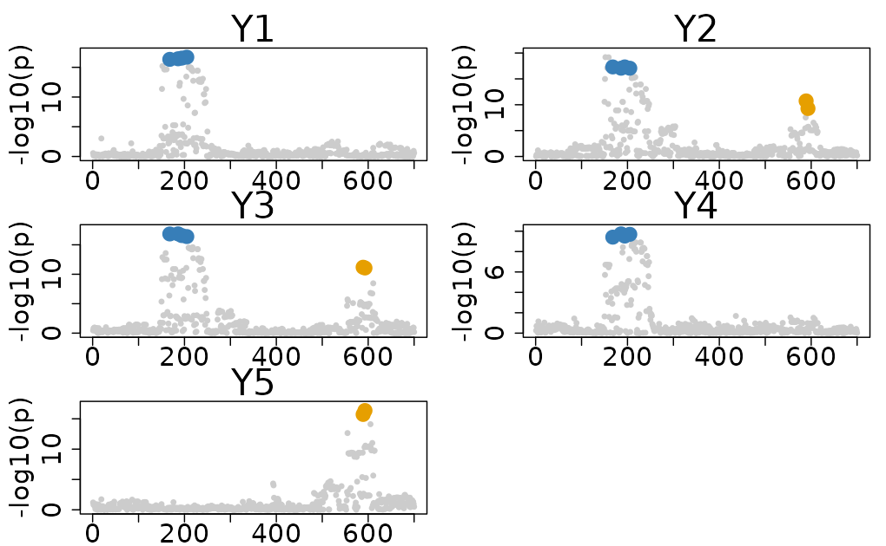

# Summary Statistics Data Colocalization

This vignette demonstrates how to perform multi-trait colocalization
analysis using summary statistics data, specifically focusing on the
`Sumstat_5traits` dataset included in the package.

\
[`library`](https://rdrr.io/r/base/library.html)`(`[`colocboost`](https://github.com/StatFunGen/colocboost)`)`

## 1. The `Sumstat_5traits` Dataset

The `Sumstat_5traits` dataset contains 5 simulated summary statistics,
where it is directly derived from the `Ind_5traits` dataset using
marginal association. The dataset is specifically designed to evaluate
and demonstrate the capabilities of ColocBoost in multi-trait
colocalization analysis with summary association data.

- `sumstat`: A list of data.frames of summary statistics for different
  traits.
- `true_effect_variants`: True effect variants indices for each trait.
- Note that `LD` could be calculated from the `X` data in the
  `Ind_5traits` dataset, but it is not included in the `Sumstat_5traits`
  dataset.

#### Causal variant structure

The dataset features two causal variants with indices 194 and 589.

- Causal variant 194 is associated with traits 1, 2, 3, and 4.
- Causal variant 589 is associated with traits 2, 3, and 5.

This structure creates a realistic scenario in which multiple traits are
influenced by different but overlapping sets of genetic variants.

\
`# Loading the Dataset`\
[`data`](https://rdrr.io/r/utils/data.html)`(``"Sumstat_5traits"``)`\
[`names`](https://rdrr.io/r/base/names.html)`(``Sumstat_5traits``)`\
`#> [1] "sumstat"              "true_effect_variants"`\
`Sumstat_5traits``$``true_effect_variants`\
`#> $Outcome_1`\
`#> [1] 194`\
`#> `\
`#> $Outcome_2`\
`#> [1] 194 589`\
`#> `\
`#> $Outcome_3`\
`#> [1] 194 589`\
`#> `\
`#> $Outcome_4`\
`#> [1] 194`\
`#> `\
`#> $Outcome_5`\
`#> [1] 589`

Due to the file size limitation of CRAN release, this is a subset of
simulated data. See full dataset in [colocboost paper
repo](https://github.com/StatFunGen/colocboost-paper).

#### Important data format for summary data

`sumstat` must include the following columns:

- `z` or (`beta`, `sebeta`): either z-score or (effect size and standard
  error)
- `n`: sample size for the summary statistics. **Highly recommended**:
  Providing the sample size, or even a rough estimate of `n`, is highly
  recommended. Without `n`, the implicit assumption is `n` is large
  (Inf) and the effect sizes are small (close to zero).
- `variant`: required if `sumstat` for different outcomes do not have
  the same number of variables (multiple `sumstat` and multiple `LD`).

\
[`class`](https://rdrr.io/r/base/class.html)`(``Sumstat_5traits``$``sumstat``[[``1``]``]``)`\
`#> [1] "data.frame"`\
[`head`](https://rdrr.io/r/utils/head.html)`(``Sumstat_5traits``$``sumstat``[[``1``]``]``)`\
`#>              z    n variant`\
`#> 451 -1.0945531 1153    rs_1`\
`#> 452 -0.4113347 1153    rs_2`\
`#> 453 -0.4113347 1153    rs_3`\
`#> 454 -0.7467923 1153    rs_4`\
`#> 455 -0.3018575 1153    rs_5`\
`#> 456 -0.5256479 1153    rs_6`

## 2. Multiple summary statistics data with shared LD reference

The preferred format for colocalization analysis in ColocBoost using
summary statistics data is where one LD matrix is provided for all
traits, and the summary statistics are organized in a list. The **Basic
format** is

- `sumstat` is organized as a list of data.frames for all traits
- `LD` is a matrix of linkage disequilibrium (LD) information for all
  variants across all traits.

This function requires specifying summary statistics `sumstat` and LD
matrix `LD` from the dataset:

\
`# Extract genotype (X) and calculate LD matrix`\
[`data`](https://rdrr.io/r/utils/data.html)`(``"Ind_5traits"``)`\
`LD`` ``<-`` `[`get_cormat`](https://statfungen.github.io/colocboost/reference/get_cormat.md)`(``Ind_5traits``$``X``[[``1``]``]``)`\
\
`# Run colocboost`\
`res`` ``<-`` `[`colocboost`](https://statfungen.github.io/colocboost/reference/colocboost.md)`(``sumstat ``=`` ``Sumstat_5traits``$``sumstat``, LD ``=`` ``LD``)`\
`#> Validating input data.`\
`#> Starting gradient boosting algorithm.`\
`#> Gradient boosting for outcome 4 converged after 40 iterations!`\
`#> Gradient boosting for outcome 5 converged after 59 iterations!`\
`#> Gradient boosting for outcome 1 converged after 61 iterations!`\
`#> Gradient boosting for outcome 3 converged after 91 iterations!`\
`#> Gradient boosting for outcome 2 converged after 94 iterations!`\
`#> Performing inference on colocalization events.`\
`#> Extracting colocalization results with pvalue_cutoff = 0.001, cos_npc_cutoff = 0.2, and npc_outcome_cutoff = 0.2.`\
`#> Keep only CoS with cos_npc >= 0.2. For each CoS, keep the outcomes configurations that pvalue of variants for the outcome < 0.001 and npc_outcome >0.2.`\
\
`# Identified CoS`\
`res``$``cos_details``$``cos``$``cos_index`\
`` #> $`cos1:y1_y2_y3_y4` ``\
`#> [1] 186 194 168 205`\
`#> `\
`` #> $`cos2:y2_y3_y5` ``\
`#> [1] 589 593`\
\
`# Plotting the results`\
[`colocboost_plot`](https://statfungen.github.io/colocboost/reference/colocboost_plot.md)`(``res``)`

Alternatively, you can provide the reference panel genotype matrix
directly through `X_ref`, which avoids storing the full LD matrix:

\
`# Use reference genotype directly instead of precomputing LD`\
`X_ref`` ``<-`` ``Ind_5traits``$``X``[[``1``]``]`\
\
`# Run colocboost`\
`res`` ``<-`` `[`colocboost`](https://statfungen.github.io/colocboost/reference/colocboost.md)`(``sumstat ``=`` ``Sumstat_5traits``$``sumstat``, X_ref ``=`` ``X_ref``)`\
`#> Validating input data.`\
`#> N_ref >= P: precomputing LD from X_ref.`\
`#> Starting gradient boosting algorithm.`\
`#> Gradient boosting for outcome 4 converged after 40 iterations!`\
`#> Gradient boosting for outcome 5 converged after 59 iterations!`\
`#> Gradient boosting for outcome 1 converged after 61 iterations!`\
`#> Gradient boosting for outcome 3 converged after 91 iterations!`\
`#> Gradient boosting for outcome 2 converged after 94 iterations!`\
`#> Performing inference on colocalization events.`\
`#> Extracting colocalization results with pvalue_cutoff = 0.001, cos_npc_cutoff = 0.2, and npc_outcome_cutoff = 0.2.`\
`#> Keep only CoS with cos_npc >= 0.2. For each CoS, keep the outcomes configurations that pvalue of variants for the outcome < 0.001 and npc_outcome >0.2.`\
\
`# Identified CoS`\
`res``$``cos_details``$``cos``$``cos_index`\
`` #> $`cos1:y1_y2_y3_y4` ``\
`#> [1] 186 194 168 205`\
`#> `\
`` #> $`cos2:y2_y3_y5` ``\
`#> [1] 589 593`

#### Results Interpretation

For comprehensive tutorials on result interpretation and advanced
visualization techniques, please visit our tutorials portal at
[Visualization of ColocBoost
Results](https://statfungen.github.io/colocboost/articles/Visualization_ColocBoost_Output.html)
and [Interpret ColocBoost
Output](https://statfungen.github.io/colocboost/articles/Interpret_ColocBoost_Output.html).

## 3. Other summary statistics and LD input combinations

### 3.1. Matched LD with multiple sumstat (Trait-specific LD)

When studying multiple traits with their own trait-specific LD matrices,
you could provide a list of LD matrices matched with a list of summary
statistics.

- **Basic format**: `sumstat` and `LD` are organized as lists, matched
  by trait index,
  - `(sumstat[1], LD[1])` contains information for trait 1,
  - `(sumstat[2], LD[2])` contains information for trait 2,
  - And so on for each trait under analysis.
- **Cross-trait flexibility**:
  - There is no requirement for the same variants across different
    traits. This allows for the analysis of traits with available
    variants.
  - This is particularly useful when you have a large dataset with many
    traits and want to focus on specific variants and trait-specific LD.

\
`# Duplicate LD with matched summary statistics`\
`LD_multiple`` ``<-`` `[`lapply`](https://rdrr.io/r/base/lapply.html)`(``1``:`[`length`](https://rdrr.io/r/base/length.html)`(``Sumstat_5traits``$``sumstat``)``, ``function``(``i``)`` ``LD`` ``)`\
\
`# Run colocboost`\
`res`` ``<-`` `[`colocboost`](https://statfungen.github.io/colocboost/reference/colocboost.md)`(``sumstat ``=`` ``Sumstat_5traits``$``sumstat``, LD ``=`` ``LD_multiple``)`\
`#> Validating input data.`\
`#> Starting gradient boosting algorithm.`\
`#> Gradient boosting for outcome 4 converged after 40 iterations!`\
`#> Gradient boosting for outcome 5 converged after 59 iterations!`\
`#> Gradient boosting for outcome 1 converged after 61 iterations!`\
`#> Gradient boosting for outcome 3 converged after 91 iterations!`\
`#> Gradient boosting for outcome 2 converged after 94 iterations!`\
`#> Performing inference on colocalization events.`\
`#> Extracting colocalization results with pvalue_cutoff = 0.001, cos_npc_cutoff = 0.2, and npc_outcome_cutoff = 0.2.`\
`#> Keep only CoS with cos_npc >= 0.2. For each CoS, keep the outcomes configurations that pvalue of variants for the outcome < 0.001 and npc_outcome >0.2.`\
\
`# Identified CoS`\
`res``$``cos_details``$``cos``$``cos_index`\
`` #> $`cos1:y1_y2_y3_y4` ``\
`#> [1] 186 194 168 205`\
`#> `\
`` #> $`cos2:y2_y3_y5` ``\
`#> [1] 589 593`

### 3.2. LD matrix is a superset of variants across different summary statistics

When the LD matrix includes a superset of variants across different
summary statistics, with **Input Format**:

- `sumstat` is a list of data.frames for all traits
- `LD` is a matrix of linkage disequilibrium (LD) information for all
  variants across all traits.
- The LD matrix should contain superset of variants presented in the
  summary statistics data frames.
- This is particularly useful when you have a large LD matrix from a
  reference panel and want to use it for multiple summary statistics
  datasets. It allows for efficient analysis without redundancy.

\
`# Create sumstat with different number of variants - remove 100 variants in each sumstat`\
`LD_superset`` ``<-`` ``LD`\
`sumstat`` ``<-`` `[`lapply`](https://rdrr.io/r/base/lapply.html)`(``Sumstat_5traits``$``sumstat``, ``function``(``x``)`` ``x``[``-`[`sample`](https://rdrr.io/r/base/sample.html)`(``1``:`[`nrow`](https://rdrr.io/r/base/nrow.html)`(``x``)``, ``20``)``, , drop ``=`` ``FALSE``]``)`\
\
`# Run colocboost`\
`res`` ``<-`` `[`colocboost`](https://statfungen.github.io/colocboost/reference/colocboost.md)`(``sumstat ``=`` ``sumstat``, LD ``=`` ``LD_superset``)`\
`#> Validating input data.`\
`#> Starting gradient boosting algorithm.`\
`#> Gradient boosting for outcome 4 converged after 40 iterations!`\
`#> Gradient boosting for outcome 5 converged after 59 iterations!`\
`#> Gradient boosting for outcome 1 converged after 61 iterations!`\
`#> Gradient boosting for outcome 3 converged after 92 iterations!`\
`#> Gradient boosting for outcome 2 converged after 93 iterations!`\
`#> Performing inference on colocalization events.`\
`#> Extracting colocalization results with pvalue_cutoff = 0.001, cos_npc_cutoff = 0.2, and npc_outcome_cutoff = 0.2.`\
`#> Keep only CoS with cos_npc >= 0.2. For each CoS, keep the outcomes configurations that pvalue of variants for the outcome < 0.001 and npc_outcome >0.2.`\
\
`# Identified CoS`\
`res``$``cos_details``$``cos``$``cos_index`\
`` #> $`cos1:y2_y3_y5` ``\
`#> [1] 589 593`\
`#> `\
`` #> $`cos2:y1_y2_y3_y4` ``\
`#> [1] 186 159 152 210 211 213 214 209`

### 3.3. Arbitrary LD and sumstat with dictionary provided

When studying multiple traits with arbitrary LD matrices for different
summary statistics, we also provide the interface for arbitrary LD
matrices with multiple sumstat. This particularly benefits meta-analysis
across heterogeneous datasets where, for different subsets of summary
statistics, LD comes from different populations.

- **Input Format**:
  - `sumstat = list(sumstat1, sumstat2, sumstat3, sumstat4, sumstat5)`
    is a list of data.frames for all traits.
  - `LD = list(LD1, LD2)` is a list of LD matrices.
  - `dict_sumstatLD` is a dictionary matrix that index of sumstat to
    index of LD.

\
`# Create a simple dictionary for demonstration purposes`\
`LD_arbitrary`` ``<-`` `[`list`](https://rdrr.io/r/base/list.html)`(``LD``, ``LD``)`` ``# traits 1 and 2 matched to the first genotype matrix; traits 3,4,5 matched to the third genotype matrix.`\
`dict_sumstatLD`` ``=`` `[`cbind`](https://rdrr.io/r/base/cbind.html)`(`[`c`](https://rdrr.io/r/base/c.html)`(``1``:``5``)``, `[`c`](https://rdrr.io/r/base/c.html)`(``1``,``1``,``2``,``2``,``2``)``)`\
\
`# Display the dictionary`\
`dict_sumstatLD`\
`#>      [,1] [,2]`\
`#> [1,]    1    1`\
`#> [2,]    2    1`\
`#> [3,]    3    2`\
`#> [4,]    4    2`\
`#> [5,]    5    2`\
\
`# Run colocboost`\
`res`` ``<-`` `[`colocboost`](https://statfungen.github.io/colocboost/reference/colocboost.md)`(``sumstat ``=`` ``Sumstat_5traits``$``sumstat``, LD ``=`` ``LD_arbitrary``, dict_sumstatLD ``=`` ``dict_sumstatLD``)`\
`#> Validating input data.`\
`#> Starting gradient boosting algorithm.`\
`#> Gradient boosting for outcome 4 converged after 40 iterations!`\
`#> Gradient boosting for outcome 5 converged after 59 iterations!`\
`#> Gradient boosting for outcome 1 converged after 61 iterations!`\
`#> Gradient boosting for outcome 3 converged after 91 iterations!`\
`#> Gradient boosting for outcome 2 converged after 94 iterations!`\
`#> Performing inference on colocalization events.`\
`#> Extracting colocalization results with pvalue_cutoff = 0.001, cos_npc_cutoff = 0.2, and npc_outcome_cutoff = 0.2.`\
`#> Keep only CoS with cos_npc >= 0.2. For each CoS, keep the outcomes configurations that pvalue of variants for the outcome < 0.001 and npc_outcome >0.2.`\
\
`# Identified CoS`\
`res``$``cos_details``$``cos``$``cos_index`\
`` #> $`cos1:y1_y2_y3_y4` ``\
`#> [1] 186 194 168 205`\
`#> `\
`` #> $`cos2:y2_y3_y5` ``\
`#> [1] 589 593`

### 3.4. Using a reference panel genotype matrix (X_ref) instead of LD

When the number of variants P is very large, storing the full P x P LD
matrix may be infeasible. If you have the reference panel genotype
matrix from which LD would be computed, you can pass it directly via
`X_ref`. ColocBoost will compute LD products on the fly, avoiding the P
x P memory cost.

This is beneficial when the reference panel sample size (N_ref) is less
than the number of variants (P). When N_ref \>= P, ColocBoost
automatically precomputes the LD matrix internally for efficiency.

Provide either `LD` or `X_ref`, not both. The `dict_sumstatLD`
dictionary works with `X_ref` the same way as with `LD`.

\
`# Use genotype matrix directly as reference panel`\
[`data`](https://rdrr.io/r/utils/data.html)`(``"Ind_5traits"``)`\
`X_ref`` ``<-`` ``Ind_5traits``$``X``[[``1``]``]`\
\
`# Run colocboost with X_ref instead of LD`\
`res`` ``<-`` `[`colocboost`](https://statfungen.github.io/colocboost/reference/colocboost.md)`(``sumstat ``=`` ``Sumstat_5traits``$``sumstat``, X_ref ``=`` ``X_ref``)`\
`#> Validating input data.`\
`#> N_ref >= P: precomputing LD from X_ref.`\
`#> Starting gradient boosting algorithm.`\
`#> Gradient boosting for outcome 4 converged after 40 iterations!`\
`#> Gradient boosting for outcome 5 converged after 59 iterations!`\
`#> Gradient boosting for outcome 1 converged after 61 iterations!`\
`#> Gradient boosting for outcome 3 converged after 91 iterations!`\
`#> Gradient boosting for outcome 2 converged after 94 iterations!`\
`#> Performing inference on colocalization events.`\
`#> Extracting colocalization results with pvalue_cutoff = 0.001, cos_npc_cutoff = 0.2, and npc_outcome_cutoff = 0.2.`\
`#> Keep only CoS with cos_npc >= 0.2. For each CoS, keep the outcomes configurations that pvalue of variants for the outcome < 0.001 and npc_outcome >0.2.`\
\
`# Identified CoS`\
`res``$``cos_details``$``cos``$``cos_index`\
`` #> $`cos1:y1_y2_y3_y4` ``\
`#> [1] 186 194 168 205`\
`#> `\
`` #> $`cos2:y2_y3_y5` ``\
`#> [1] 589 593`

### 3.5. HyPrColoc compatible format: effect size and standard error matrices

ColocBoost also provides a flexibility to use HyPrColoc compatible
format for summary statistics with and without LD matrix.

\
`# Loading the Dataset`\
[`data`](https://rdrr.io/r/utils/data.html)`(``Ind_5traits``)`\
`X`` ``<-`` ``Ind_5traits``$``X`\
`Y`` ``<-`` ``Ind_5traits``$``Y`\
\
`# Coverting to HyPrColoc compatible format`\
`effect_est`` ``<-`` ``effect_se`` ``<-`` ``effect_n`` ``<-`` `[`c`](https://rdrr.io/r/base/c.html)`(``)`\
`for`` ``(``i`` ``in`` ``1``:`[`length`](https://rdrr.io/r/base/length.html)`(``X``)``)``{`\
`  ``x`` ``<-`` ``X``[[``i``]``]`\
`  ``y`` ``<-`` ``Y``[[``i``]``]`\
`  ``effect_n``[``i``]`` ``<-`` `[`length`](https://rdrr.io/r/base/length.html)`(``y``)`\
`  ``output`` ``<-`` ``susieR``::`[`univariate_regression`](https://rdrr.io/pkg/susieR/man/univariate_regression.html)`(``X ``=`` ``x``, y ``=`` ``y``)`\
`  ``effect_est`` ``<-`` `[`cbind`](https://rdrr.io/r/base/cbind.html)`(``effect_est``, ``output``$``beta``)`\
`  ``effect_se`` ``<-`` `[`cbind`](https://rdrr.io/r/base/cbind.html)`(``effect_se``, ``output``$``sebeta``)`\
`}`\
[`colnames`](https://rdrr.io/r/base/colnames.html)`(``effect_est``)`` ``<-`` `[`colnames`](https://rdrr.io/r/base/colnames.html)`(``effect_se``)`` ``<-`` `[`c`](https://rdrr.io/r/base/c.html)`(``"Y1"``, ``"Y2"``, ``"Y3"``, ``"Y4"``, ``"Y5"``)`\
[`rownames`](https://rdrr.io/r/base/colnames.html)`(``effect_est``)`` ``<-`` `[`rownames`](https://rdrr.io/r/base/colnames.html)`(``effect_se``)`` ``<-`` `[`colnames`](https://rdrr.io/r/base/colnames.html)`(``X``[[``1``]``]``)`\
\
`# Run colocboost`\
`LD`` ``<-`` `[`get_cormat`](https://statfungen.github.io/colocboost/reference/get_cormat.md)`(``Ind_5traits``$``X``[[``1``]``]``)`\
`res`` ``<-`` `[`colocboost`](https://statfungen.github.io/colocboost/reference/colocboost.md)`(``effect_est ``=`` ``effect_est``, effect_se ``=`` ``effect_se``, effect_n ``=`` ``effect_n``, LD ``=`` ``LD``)`\
`#> Validating input data.`\
`#> Starting gradient boosting algorithm.`\
`#> Gradient boosting for outcome 4 converged after 40 iterations!`\
`#> Gradient boosting for outcome 5 converged after 59 iterations!`\
`#> Gradient boosting for outcome 1 converged after 61 iterations!`\
`#> Gradient boosting for outcome 3 converged after 91 iterations!`\
`#> Gradient boosting for outcome 2 converged after 94 iterations!`\
`#> Performing inference on colocalization events.`\
`#> Extracting colocalization results with pvalue_cutoff = 0.001, cos_npc_cutoff = 0.2, and npc_outcome_cutoff = 0.2.`\
`#> Keep only CoS with cos_npc >= 0.2. For each CoS, keep the outcomes configurations that pvalue of variants for the outcome < 0.001 and npc_outcome >0.2.`\
\
`# Identified CoS`\
`res``$``cos_details``$``cos``$``cos_index`\
`` #> $`cos1:y1_y2_y3_y4` ``\
`#> [1] 186 194 168 205`\
`#> `\
`` #> $`cos2:y2_y3_y5` ``\
`#> [1] 589 593`

See more details about data format to implement LD-free ColocBoost and
LD-mismatch diagnosis in [LD mismatch and LD-free
Colocalization](https://statfungen.github.io/colocboost/articles/LD_Free_Colocalization.html)).
