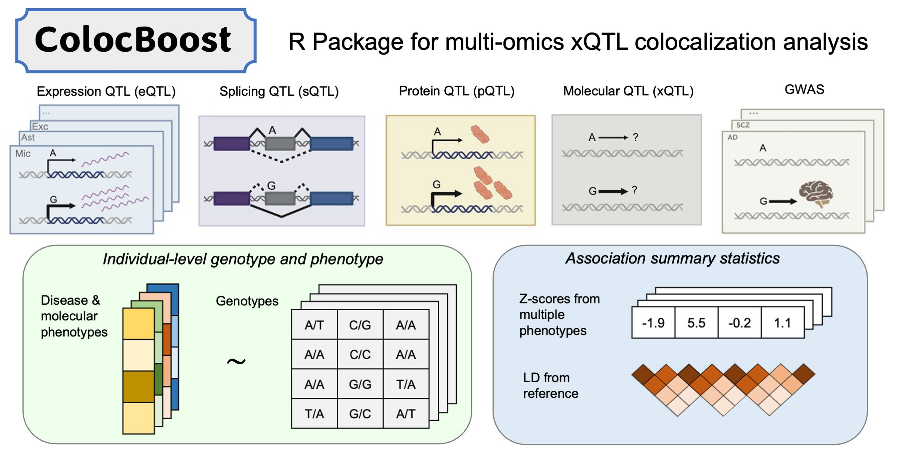

This R package implements ColocBoost—motivated and designed for
colocalization analysis of multiple genetic association studies—as a
multi-task learning approach to variable selection regression with
highly correlated predictors and sparse effects, based on frequentist
statistical inference. It provides statistical evidence to identify
which subsets of predictors have non-zero effects on which subsets of
response variables.

## Quick Start

### CRAN Installation (Stable Release)

Install major and stable releases from CRAN (Linux, macOS and Windows)

\
[`install.packages`](https://rdrr.io/r/utils/install.packages.html)`(``"colocboost"``)`

### GitHub Installation

Install the development version from GitHub

\
`devtools``::`[`install_github`](https://devtools.r-lib.org/reference/install-deprecated.html)`(``"StatFunGen/colocboost"``)`

For a detailed installation guidance, please refer to
[Installation](https://statfungen.github.io/colocboost/articles/installation.html).

## Tutorial Website

Learn how to perform colocalization analysis with step-by-step examples.
For detailed tutorials and use cases in
[Tutorials](https://statfungen.github.io/colocboost/articles/index.html).

## Citation

If you use ColocBoost in your research, please cite:

> Cao X, Sun H, Feng R, Mazumder R, Najar CFB, Li YI, de Jager PL,
> Bennett D, The Alzheimer’s Disease Functional Genomics Consortium, Dey
> KK, Wang G. (2025+). Integrative multi-omics QTL colocalization maps
> regulatory architecture in aging human brain. medRxiv.
> <https://doi.org/10.1101/2025.04.17.25326042>

## License

This package is released under the MIT License.
