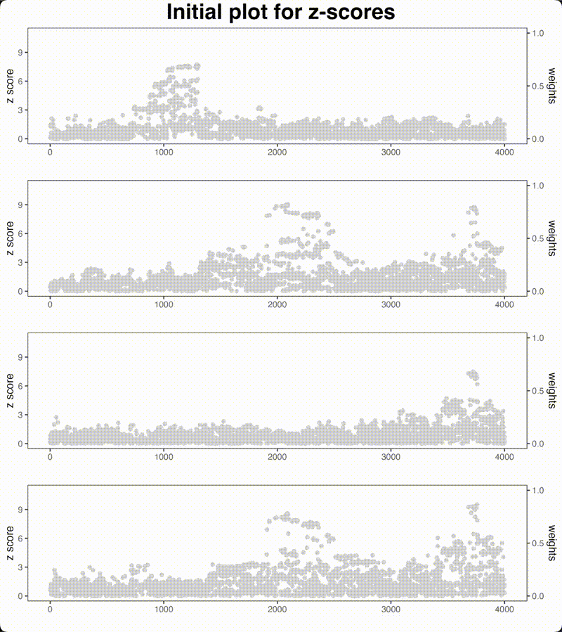

```{r, include = FALSE}
knitr::opts_chunk$set(
  collapse = TRUE,
  comment = "#>"
)
```


This vignette visualizes the iterative process of proximity gradient boosting proposed in ColocBoost from an extensive simulation example.


- **Red point**: the standard gradient boosting update for only the best single-effect variant $j_k^*$ in each iteration.
- **Blue points**: the proximity gradient boosting update, where it probabilistically incorporates the LD proxies of $j_k^*$ by applying a convex relaxation to the gradient.

The animation below demonstrates how ColocBoost iteratively updates across multiple rounds. 
Observe how the blue points (proxies) distribute around the selected best update, showing the algorithm's ability to capture LD structure during optimization.

```{r, out.width="80%"}

```


See more details in the [ColocBoost Manuscript](https://www.medrxiv.org/content/10.1101/2025.04.17.25326042v1) and the [GitHub repository](https://github.com/StatFunGen/colocboost).