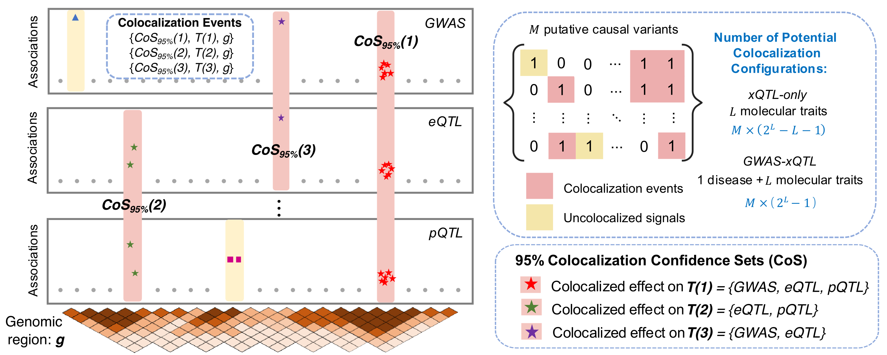
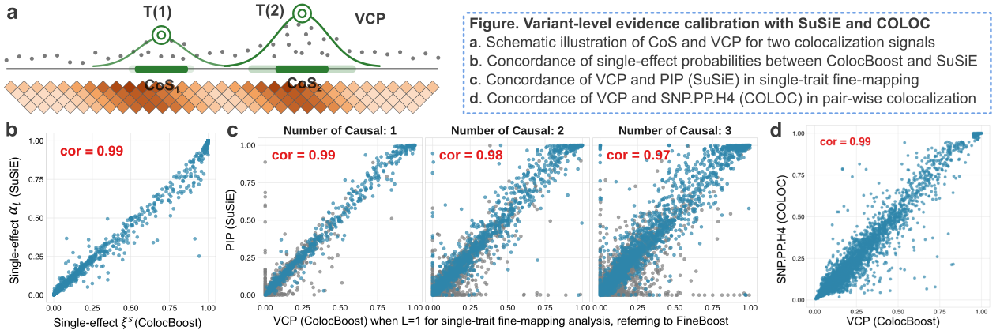
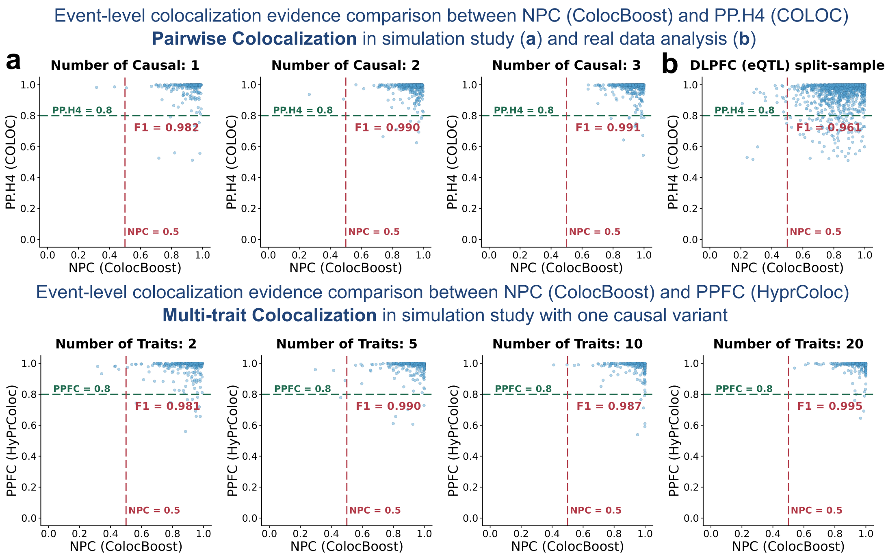

<style>
.note-box {
  background-color: #f2f2f2;
  border-left: 4px solid #a8a8a8;
  border-radius: 4px;
  padding: 12px 16px;
  margin: 16px 0;
  color: #333333;
  font-style: italic;
}

.note-box p {
  margin: 0;
}
</style>

```{r, include = FALSE}
knitr::opts_chunk$set(
  collapse = TRUE,
  comment = "#>",
  dpi = 70
)
```

This vignette introduces key conceptual definitions for multi-trait colocalization, describes their practical implementation in ColocBoost, 
and relates them to established concepts in fine-mapping and existing colocalization methods.

# 1. Multi-trait colocalization problem as a colocalization event decomposition

The multi-trait colocalization problem concerns identifying *shared causal signals* across \(L \geq 2\) traits within a genomic region of interest. 
To formalize this problem, ColocBoost introduces a new conceptual definition of a multi-trait ***Colocalization Event*** as a triplet \( \{ g(s), T(s), CoS_{\alpha}(s) \} \) for each detected event \(s\), comprising 

- \(g(s)\): ***Genomic Region*** underlying the colocalization analysis.
- \(T(s)\): ***Trait Configuration*** specifying which subset of \(L\) traits share the same causal variant for event \(s\).
- \(CoS_{\alpha}(s)\): ***Colocalization Confidence Set*** representing the smallest set of variants containing the shared causal variant with probability at least \(\alpha\) (default \(\alpha = 0.95\)).

A <u>*central challenge*</u> in multi-trait colocalization is that multiple events can arise within the same genomic region, involving overlapping or distinct sets of traits and multiple causal variants. 

- In Bayesian formulations that specify all possible trait configurations a *priori*, the hypothesis space grows combinatorially and rapidly becomes computationally prohibitive. 
- ColocBoost avoids this enumeration by reformulating colocalization as a multi-task learning problem optimized through gradient boosting. This formulation jointly resolves multiple colocalization events and scales to hundreds of traits.





# 2. Conceptual ColocBoost summaries and their analogies to existing methods

ColocBoost characterizes each event using two complementary summaries: variant-level localization and event-level evidence for sharing across the corresponding trait configuration.
These summaries have direct structural analogies to established quantities in fine-mapping and colocalization, while being defined specifically for multi-trait colocalization events.

- **Variant-level evidence:** The ***colocalization confidence set*** (CoS) and ***variant colocalization probability*** (VCP) localize the variants underlying each colocalization event. 
They are structurally analogous to the credible set (CS) and posterior inclusion probability (PIP), respectively, in statistical fine-mapping methods such as SuSiE.

- **Colocalization evidence:** The ***normalized probability of colocalization*** (NPC) quantifies support for colocalization. 
It is structurally analogous to PP.H4 in COLOC for pairwise colocalization and PPFC in HyPrColoc for multi-trait colocalization.


## 2.1. Variant-level evidence

For each event \(s\), representing a single causal signal shared by the subset of traits \(T(s)\), 

- \(\xi^s = (\xi_1^s, \ldots, \xi_P^s)\) denotes the vector of *single-effect colocalization probabilities* across \(P\) variants in the region, quantifying the probability that each variant is the shared causal variant underlying traits \(T(s)\).
- <span style="color:#1D4F91;"><u>Structural analogy</u></span>: single-effect posterior \( \alpha_l \) in SuSiE for single-effect \(l\) in a single-trait model.

ColocBoost then defines an \(\alpha\)-level *Colocalization Confidence Set*, \(CoS_{\alpha}(s)\) (default \(\alpha = 0.95\)), including the candidate causal variant and its high-LD proxies, 
with construction based on \(\xi^s\):

\[
  CoS_{\alpha}(s) = \left\{  v_1, v_2, \ldots, v_{p_0} : p_0 = \min (p: \sum_{j=1}^p \xi_{(j)}^s \geq \alpha )  \right\},
\]

where \(\xi_{(1)}^s \geq \ldots \geq \xi_{(P)}^s\) are the sorted single-effect colocalization probabilities. 
ColocBoost discards the CoS with low *purity* (minimum absolute correlation between all pairs of variants within CoS, default threshold \(purity < 0.5\)).

- <span style="color:#1D4F91;"><u>Structural analogy</u></span>: \(\alpha\)-level credible set (CS) in SuSiE in a single-trait model.

ColocBoost also defines the *variant colocalization probability* (VCP) for each variant \(j\) in the region as
\[
  VCP_j = 1 - \prod_{s=1}^{S} (1 - \xi_j^s).
\]
The construction of VCP is based on the assumption that each event \(s\) is *conditionally* independent. 

- <span style="color:#1D4F91;"><u>Structural analogy</u></span>: posterior inclusion probability (PIP) in SuSiE in a single-trait model.
- <span style="color:#1D4F91;"><u>Structural analogy</u></span>: variant-level posterior probability for H4 (SNP.PP.H4) in COLOC in a pairwise colocalization analysis.




## 2.2. Colocalization evidence

### Narrative definition of normalized probability of colocalization (NPC)

For each event \(s\), ColocBoost defines the *normalized probability of colocalization* (NPC) as an empirical, event-level measure comparing shared colocalization with trait-specific alternatives.

- Higher NPC values indicate stronger evidence that the event represents a causal signal shared by at least two traits.
- Lower NPC values indicate weaker evidence for sharing, while greater consistency with the single-trait specific causal signals.

NPC is <span style="color:#1D4F91;"><u>structurally analogous</u></span>, but not probabilistically equivalent, to 

- PP.H4: posterior probability of H4, two traits shared the same causal variant, in COLOC for pairwise colocalization.
- PPFC: posterior probability of full colocalization in HyPrColoc for multi-trait colocalization. 

NPC is assigned to each detected colocalization event \(s\), allowing multiple distinct events within the same genomic region and a potentially different trait configuration \(T(s)\).

::: {.note-box}
**Note:** PP.H4 is defined **only** for two traits and denotes posterior probability for \(H_4\), the hypothesis that both traits are associated and share the same causal variant, 
relative to hypotheses \(H_0\), \(H_1\), \(H_2\), and \(H_3\). For \(L > 2\), the colocalization hypothesis space must encompass all possible trait configurations across shared and distinct causal variants (Foley et al., 2021, *Nature Communications*). 
For example, \(H_{(L-2,1,1)}\) represents a configuration in which \(L-2\) traits share one causal variant, while the remaining two traits have distinct causal variants. 
The full hypothesis space grows combinatorially, comprising \(\mathrm{Bell}(L+1)\) hypotheses.
:::

ColocBoost avoids this combinatorial explosion by discovering supported configurations \(T(s)\) and their corresponding \(CoS_{\alpha}(s)\) in a data-driven manner, 
without enumerating all possible trait configurations (details in ColocBoost paper).


### Mathematical definition of normalized probability of colocalization (NPC)

For a detected colocalization event \(s\) with a triplet \( \{ g(s), T(s), CoS_{\alpha}(s) \} \), 
ColocBoost first defines the trait-level normalized evidence score \(NP_l^s\) for each trait \(l \in T(s)\):

\[
  NP_l^s = 1 - \exp(-\lambda_l LRT_l^s),
\]

where \(\lambda_l \) is a trait-specific rate that adjusts the scale of normalization based on a baseline log-likelihood ratio for each trait \(l\) (details in Supplementary Note of ColocBoost paper).

Here, \(LRT_l^s\) is a log-likelihood ratio test statistic between two models, \(M^s_{0,l}\) and \(M^s_{1,l}\).

- \(M^s_{0,l}\): the null model where all variants have zero effects on trait \(l\) (\( \beta_l=0 \)).
- \(M^s_{1,l}\): the alternative model that variants in \(CoS_{\alpha}(s)\) have non-zero effects (\( \beta^s_l \neq 0 \)).

::: {.note-box}
***Rationale:*** NPC is evaluated only after event \(s\) has been detected; therefore, at least one trait is expected to provide strong evidence for the event.
NPC provides event-level evidence that the detected event is jointly supported by at least two traits, rather than being driven by evidence from only one trait.
:::

**Two-trait example**

For the two-trait case, without loss of generality, let \(NP_1^s \ge NP_2^s\), so that trait 1 is the leading trait for event \(s\). 
ColocBoost approximates the evidence for the single-trait, non-colocalized configuration, in which trait 1 contributes but trait 2 does not, as

\[
NPUC_s
=
\underbrace{NP_1^s}_{
\substack{\text{evidence supporting}\\
\text{trait 1 contribution}}
}
\times
\underbrace{(1-NP_2^s)}_{
\substack{\text{lack of evidence supporting}\\
\text{trait 2 contribution}}
}.
\]

Accordingly, <u>a large NPUC indicates that event \(s\) is supported **primarily** by the leading trait</u>. 
ColocBoost subsequently defines the event-level colocalization evidence NPC as

\[
  NPC_s = 1 - NPUC_s.
\]

NPUC and NPC are normalized colocalization evidence scores rather than posterior probabilities.

**Multi-trait generalization**

For \(L>2\), ColocBoost generalizes NPUC as the *leading-trait-only explanation* across all traits:

\[
NPUC_s = NP^s_{l_{\max}} \prod_{l\neq l_{\max}} \left(1-NP_{l}^{s}\right), \, \mathrm{and} \, NPC_s = 1 - NPUC_s.
\]

Here, \(NP^s_{l_{\max}}\) represents the normalized evidence from the leading trait, whereas the product term captures the lack of support from the remaining traits. 
Together, these terms quantify the extent to which event \(s\) is supported primarily by the leading trait. 
Accordingly, a high NPC indicates support from more than one trait.


::: {.note-box}
**Highlight:** ColocBoost provides complementary evidence at two levels: \(NPC_s\) evaluates the overall colocalization event, 
whereas \(NP_l^s\) quantifies each trait's support for that event. 
In our numerical studies, the lenient thresholds \(NPC_s \geq 0.5\) and \(NP_l^s \geq 0.2\) maintained well-controlled FDR while retaining reasonable detection power. 
More stringent thresholds may be applied to prioritize the strongest colocalization signals.
:::

See more details about filtering colocalization events by relative strength of evidence 
using ['get_robust_colocalization'](https://statfungen.github.io/colocboost/articles/Interpret_ColocBoost_Output.html#filter-colocalization-events-by-relative-strength-of-evidence) function.





Concordance between NPC and PP.H4 or PPFC was assessed only for detected CoS with at least 95% overlap variants between ColocBoost and COLOC or HyPrColoc, respectively.


# 3. Practical interpretation for `colocboost` output

This section maps the concepts above to the corresponding `colocboost` output fields. 
See [Interpret ColocBoost Output](https://statfungen.github.io/colocboost/articles/Interpret_ColocBoost_Output.html) for detailed guidance.

After running `res = colocboost()`, 

- `res$cos_summary`: a summary of all colocalization events. Each row corresponds to one colocalization event \(s\) and includes columns with
  - `colocalized_outcomes`: *Trait Configuration* -- \(T(s)\);
  - `colocalized_variables`: *Colocalization Confidence Set* -- \(CoS_{\alpha}(s)\);
  - `colocalized_variables_vcp`: *Variant Colocalization Probability* for shared variants in \(CoS_{\alpha}(s)\);
  - `cos_npc`: *Normalized Probability of Colocalization* -- \(NPC_s\);
  - `purity`: minimum absolute correlation between all pairs of variants within \(CoS_{\alpha}(s)\).
- `res$cos_details`: detailed information about all colocalization events, including sublists with
  - `vcp`: a length-\(P\) vector of *Variant Colocalization Probability* for all \(P\) variants;
  - `cos_vcp`: a list of single-effect colocalization probabilities for each event \(s\);
  - `cos_outcomes_npc`: a list of trait-level evidence (\(NP^s_l\)) for each event \(s\).

## Example: Causal variant structure
The dataset features two causal variants with indices 194 and 589.

- Causal variant 194 is associated with traits 1, 2, 3, and 4.
- Causal variant 589 is associated with traits 2, 3, and 5.

```{r run-colocboost}
library(colocboost)
# Loading the Dataset
data(Ind_5traits)
# Run colocboost 
res <- colocboost(X = Ind_5traits$X, Y = Ind_5traits$Y)
```

Colocalization events summary:
```{r events_summary}
cos_summary <- res$cos_summary
cos_summary[, 
  c(
    "colocalized_outcomes",
    "colocalized_variables",
    "colocalized_variables_vcp",
    "cos_npc",
    "purity"
  )
]
```

Trait-level evidence:
```{r trait_level}
res$cos_details$cos_outcomes_npc
```
