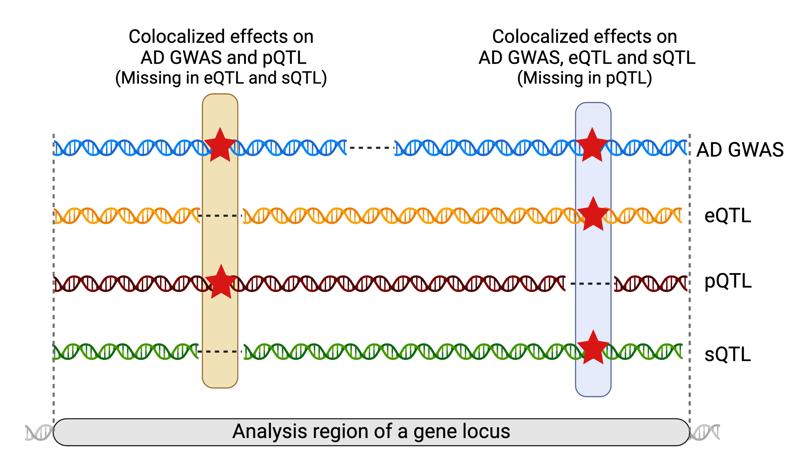

```{r, include = FALSE}
knitr::opts_chunk$set(
  collapse = TRUE,
  comment = "#>",
  dpi = 80
)
```

This vignette demonstrates how ColocBoost handles partial overlapping variants across traits in ColocBoost.


```{r setup}
library(colocboost)
```




### Causal variant structure

We create an example data from `Ind_5traits` with two causal variants, 644 and 2289, but each of them is only partially overlapping across traits.

- Causal variant 194 is associated with traits 1, 3, and 4, but is missing in trait 2.
- Causal variant 589 is associated with traits 2 and 3, but is missing in trait 5.

This structure creates a realistic scenario in which multiple traits from different datasets are not fully overlapping, and the causal variants are not shared across all traits.

```{r make-data}
# Load example data
data(Ind_5traits)
X <- Ind_5traits$X
Y <- Ind_5traits$Y

# Create causal variants with potentially LD proxies
causal_1 <- c(100:350)
causal_2 <- c(450:650)

# Create missing data
X[[2]] <- X[[2]][, -causal_1, drop = FALSE]
X[[3]] <- X[[3]][, -causal_2, drop = FALSE]

# Show format
X[[2]][1:2, 1:6]
X[[3]][1:2, 1:6]
```

## 1. Run ColocBoost with partial overlapping variants

To run ColocBoost on different genotypes with different causal variants, the variant names should be provided as the column names of the `X` matrices.
Otherwise, the `colocboost` function will not be able to identify the variants correctly from different genotype matrices,
and the analysis will fail with the error message `Please verify the variable names across different outcomes.`

```{r run-code}
# Run colocboost
res <- colocboost(X = X, Y = Y)

# The number of variants in the analysis
res$data_info$n_variables

# Plotting the results
colocboost_plot(res)
```

## 2. Limitations of using only overlapping variables

If we perform a colocalization analysis using only overlapping variables, we may fail to detect any colocalization events.
This is because the causal variants, which are only partially overlapping across traits, are excluded during the preprocessing step. 
As a result, even though these variants are associated with some traits, they are removed from the analysis, leading to a loss of critical information. 
This highlights the importance of handling partial overlaps effectively to ensure that meaningful colocalization signals are not missed.

```{r run-code-overlap}
# Run colocboost with only overlapping variables
res <- colocboost(X = X, Y = Y, overlap_variables = TRUE)

# The number of variants in the analysis
res$data_info$n_variables

# Plotting the results
colocboost_plot(res)
```


## 3. Disease-prioritized colocalization analysis with variables in the focal trait

In disease-prioritized colocalization analysis with a focal trait, `ColocBoost` recommends prioritizing variants in the focal trait as the default setting. 
For the example above, if we consider trait 3 as the focal trait, only variants present in trait 3 will be included in the analysis. 
This ensures that the analysis focuses on variants relevant to the focal trait while also accounting for partial overlaps across other traits.
If you want to include all variants across traits, you can set `focal_outcome_variables = FALSE` to override this default behavior.

```{r run-code-focal}
# Run colocboost
res <- colocboost(X = X, Y = Y, focal_outcome_idx = 3)

# The number of variants in the analysis
res$data_info$n_variables

# Plotting the results
colocboost_plot(res)
```

